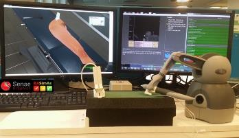

# VG-LAB · Proyecto Marp

La presentación utiliza **cinco tipos de diapositiva reutilizables**. El diseño común está en `theme.css`; los textos, las imágenes, los vídeos y las notas están en `presentacion.md`. No hay una clase distinta para cada transparencia.

## Abrir

Descomprime el ZIP y abre la carpeta **`vg_lab_marp` completa** en VS Code, o abre `vg-lab.code-workspace`. Después abre `presentacion.md` y la vista previa de Marp. La configuración de `.vscode/` registra el tema y permite el HTML necesario para vídeos y recuadros. Revisa el proyecto antes de conceder confianza al espacio de trabajo.

No necesitas instalar Node ni las dependencias del proyecto para trabajar con la extensión Marp que ya tienes instalada. Mantén `theme.css`, `presentacion.md` y `assets/` en sus posiciones actuales.

## Los cinco tipos

| Clase | Uso |
| --- | --- |
| `cover` | Portada. El Markdown solo contiene el título y el subtexto. La fotografía y todos los logotipos se definen en el tema. |
| `text` | Título y texto Markdown a todo el ancho. |
| `split` | Texto a la izquierda e imagen a la derecha. Admite composiciones especiales con divs. |
| `sidebar` | Columna estrecha de texto y cuadrícula de imágenes o vídeos a la derecha. |
| `figure` | Título y figura grande. También sirve de base para collages y otros elementos con posición propia. |

Cada diapositiva selecciona una de estas clases con una directiva:

```markdown
<!-- _class: text -->

# Slide title

**Main point:** ordinary Markdown text.
```

`plantillas.md` contiene ejemplos de los cinco tipos. La portada no contiene imágenes, HTML ni divs en el Markdown. Los títulos comunes siguen siendo cabeceras `#`, y su posición se controla en el tema. Los textos comunes tampoco necesitan divs.

En `sidebar`, los cuatro elementos multimedia se colocan **arriba a la izquierda, arriba a la derecha, abajo a la izquierda y abajo a la derecha**, en ese orden. Cada imagen o vídeo debe ocupar un bloque separado por líneas en blanco. Puedes sustituir las imágenes por otras o por etiquetas de vídeo sin crear una plantilla nueva. Se conservan sus proporciones dentro de los huecos.

En `figure`, una imagen Markdown sin div se centra en el área de figura. En `split`, una imagen Markdown sin div ocupa la columna derecha.

## Las excepciones

Las imágenes de collages, los recortes y los textos que necesitan una posición independiente pueden usar un div. **No se han convertido esos casos en tipos de diapositiva adicionales.** Los divs usan componentes genéricos del tema: `media`, `box`, `caption`, `callout`, `command`, `panel` y `arrow`.

Solo los parámetros particulares de esos objetos permanecen junto a ellos en el MD: `--x`, `--y`, `--w`, `--h` y `--z` controlan la posición, el tamaño y el orden de superposición. Los recortes pueden añadir variables `--image-*`. Las reglas de presentación siguen en `theme.css`.

```markdown
<div class="media" style="--x: 80px; --y: 220px; --w: 360px; --h: 240px">



</div>

<div class="callout" style="--x: 360px; --y: 240px; --w: 220px; --h: 100px">

**Highlighted text**

</div>
```

Conserva las líneas en blanco entre la etiqueta y el Markdown interior. El uso de variables locales en estas excepciones evita llenar el tema de clases que solo sirven para una diapositiva. Los formatos de texto comunes no están repetidos en el MD.

La diapositiva azul, con una gran imagen a la derecha, se mantiene como composición excepcional mediante divs; no tiene una plantilla propia. Los comandos `ffmpeg` superpuestos conservan su componente compartido `command`.

## Cambiar el diseño común

Edita `theme.css`. Al principio se definen el fondo, la cabecera y el título. Después aparecen, por separado, los cinco tipos y los componentes de las excepciones.

Las variables `--title-left`, `--title-top`, `--title-width` y `--title-height` controlan los títulos. Las variables `--body-left`, `--body-top`, `--body-width`, `--body-size` y `--paragraph-gap` controlan el área de texto. La fotografía y los logotipos de portada están en las capas de fondo de `section.cover`. La fotografía se muestra completa y conserva sus proporciones; los logotipos se sitúan en la franja inferior.

Los pies originales del 26 al 32 se mantienen como directivas `_footer`. Su presencia conserva las posiciones del título y de la numeración; no exige una clase adicional. Las diapositivas usan el fondo institucional sin el logotipo de ETSII en el pie.

Al agrupar los diseños se han unificado las posiciones del texto común y de la cuadrícula lateral. **El resultado no pretende coincidir píxel a píxel con la versión anterior**: esa normalización evita las antiguas clases específicas. Las composiciones excepcionales conservan sus coordenadas y recortes.

## Archivos incluidos

`presentacion.md` es la presentación; `theme.css`, la plantilla; `plantillas.md`, los ejemplos. `assets/` conserva los recursos originales. `vista_previa.html` es un visor independiente con navegación y notas. `original/` conserva el PowerPoint; `extracted/`, la extracción de texto, notas, comentarios e inventarios. `reference/` contiene capturas e informes; los que empiezan por `previous-` corresponden a la entrega anterior, no a esta versión.

Las 23 diapositivas y sus notas se conservan. No se han corregido ni eliminado los textos del borrador, los comandos `ffmpeg` visibles, las superposiciones o las diapositivas finales casi vacías.

## Vídeos

Los cinco vídeos enlazados por el PowerPoint **no estaban incrustados en el fichero original**. Se conservan sus etiquetas, pósteres y rutas; no se han fabricado vídeos sustitutivos. Consulta `assets/videos/LEEME.md` y `missing-videos.json`.

Para incorporar uno de los archivos recuperados:

```bash
python scripts/attach_video.py --slide 7 --file /path/to/video.mp4 --preview
```

La diapositiva 13 tiene dos vídeos; añade `--shape-id` con el identificador del inventario para elegir uno. También puedes copiar el vídeo directamente a la ruta indicada en su etiqueta. Los cambios en los vídeos requieren regenerar cualquier HTML exportado.

## Exportar y comprobar

### PowerPoint con vídeos incrustados

Después de exportar **la versión actual** de `presentacion.md` a
`presentacion.pptx` con Marp, ejecuta:

```bash
python scripts/embed_pptx_videos.py
```

También está disponible en VS Code: **Terminal → Ejecutar tarea → PowerPoint:
incrustar vídeos tras exportar con Marp**. Genera `presentacion-con-videos.pptx`
y conserva el PowerPoint original. Los vídeos quedan dentro del archivo:
no necesitas llevar la carpeta `assets` al ordenador de la presentación.
En modo presentación, haz clic sobre el vídeo para reproducirlo.

Requiere Python 3.10 o posterior y **FFmpeg** (`ffmpeg` y `ffprobe` en el PATH).
No necesita paquetes de Python. Lee las rutas relativas de las etiquetas
`<video src="…">` y las coordenadas de `theme.css` y de los divs `media`.
Admite los diseños actuales `sidebar`, `split`, `figure` y los divs `media`
con coordenadas en píxeles, sin recortes ni contenedores anidados. Para los
vídeos de la cuadrícula conserva las proporciones sobre fondo blanco; en
los divs conserva el ajuste `fill` del tema. Usa el primer fotograma como
imagen inicial. Valida que los MP4 utilicen H.264 y, si hay audio, AAC.

Si cambias el Markdown o el tema, **vuelve a exportar con Marp y repite el
comando**. El script comprueba el número y proporción de las diapositivas,
pero no puede detectar todos los cambios de contenido en un PPTX antiguo.
No uses como entrada el archivo que ya contiene los vídeos.

Si tienes Marp CLI instalado (`npm install`), puedes hacer ambos pasos con:

```bash
npm run pptx
```

La configuración para Marp CLI está incluida:

```bash
npm install
npm run html
npm run pdf
npm run preview
```

Para comprobar rutas y tipos de diapositiva, sin dependencias adicionales:

```bash
python scripts/check_project.py
```

Para regenerar el visor independiente:

```bash
python -m pip install -r scripts/requirements-preview.txt
python scripts/build_preview.py
```

El visor independiente sirve para revisar el contenido y el diseño, pero no sustituye la exportación nativa de Marp. En esta entrega se ha revisado el visor en Chromium y se han comprobado los textos, notas, recursos y los cinco tipos. No se ha ejecutado la extensión de VS Code en este entorno. Las fuentes disponibles en tu equipo pueden afectar al resultado.

## Documentación técnica

- [Temas CSS de Marpit](https://marpit.marp.app/theme-css)
- [Directivas de Marpit](https://marpit.marp.app/directives)
- [Marp for VS Code](https://github.com/marp-team/marp-vscode)
