<!-- _class: cover -->

# Inside VG-LAB: Some of Work Lines

*Marcos García Lorenzo*
marcos.garcía@urjc.es

---

<!-- _class: split -->

# URJC

URJC stands for Universidad Rey Juan Carlos

Fundada en 1996

6ª Universidad Pública de la CAM

5 Campus: Madrid, Móstoles, Alcorcón, Fuenlabrada y Aranjuez

Más de 40.000 alumnos

2ª Universidad de la CAM y 7ª de España en número de alumnos

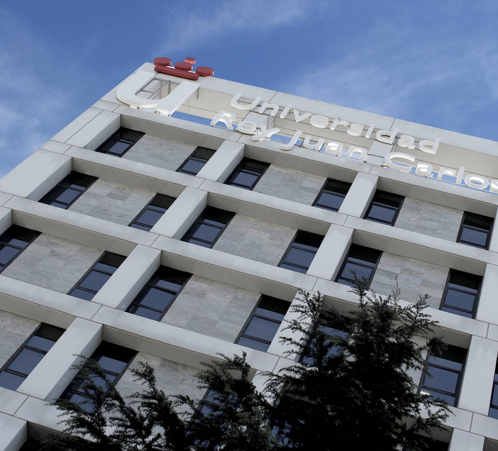

---

<!-- _class: split -->
<!-- _backgroundImage: url("assets/images/image6.png") -->

# ETSII

Around 200 faculty members.

8 simple degrees

9 double degrees

6 Master Degree

1Phd Program in IT

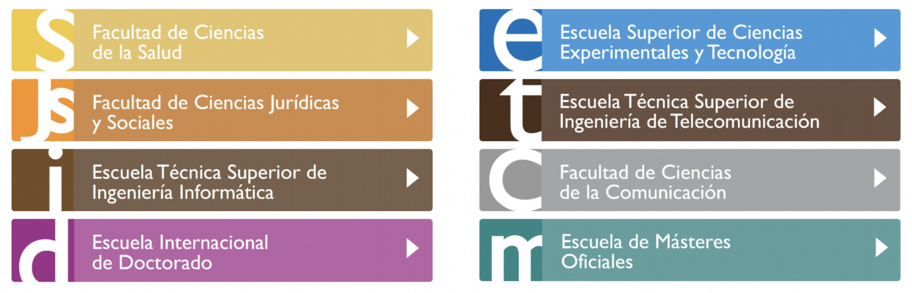

MÓSTOLES

<!--
Historia:

Ingenierías Técnicas de Informática de Sistemas y de Gestión (desde el curso 97-98)

Escuela Técnica Superior de Ingeniería Informática, creada en julio del 2007
-->

---

<!-- _class: figure -->

# VG-LAB

<!--
Historia:

Ingenierías Técnicas de Informática de Sistemas y de Gestión (desde el curso 97-98)

Escuela Técnica Superior de Ingeniería Informática, creada en julio del 2007
-->

---

<!-- _class: text -->

# VG-LAB

**Primeras lineas de trabajo:**

**Computer graphics:** Virtual reality, haptic interaction, medical trainers, simulation, rendering

**High-performance computing:** Distributed computing, GPGPU, load balancing

**Lineas actuales:**

**Visualization:** scientific visualization, information visualization and exploratory analysis

**Machine leaning and Deep learning**

---

<!-- _class: figure -->

# Computer Graphics and Medical Simulation

<!--

Ingenierías Técnicas de Informática de Sistemas y de Gestión (desde el curso 97-98)

Escuela Técnica Superior de Ingeniería Informática, creada en julio del 2007
-->

---

<!-- _class: sidebar -->

# Projectional Radiography Simulator

An interactive learning environment for diagnostic radiography that enables educators to bridge the disconnects between theory and practice

[https://vg-lab.es/xraysim/](https://vg-lab.es/xraysim/)

<video controls preload="none" playsinline poster="assets/images/image18.png" src="assets/videos/slide-07-1158545669.mp4" aria-label="videoplayback"></video>

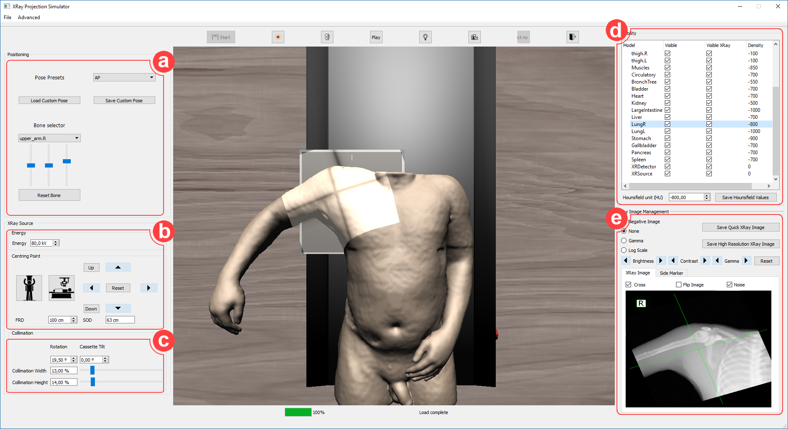

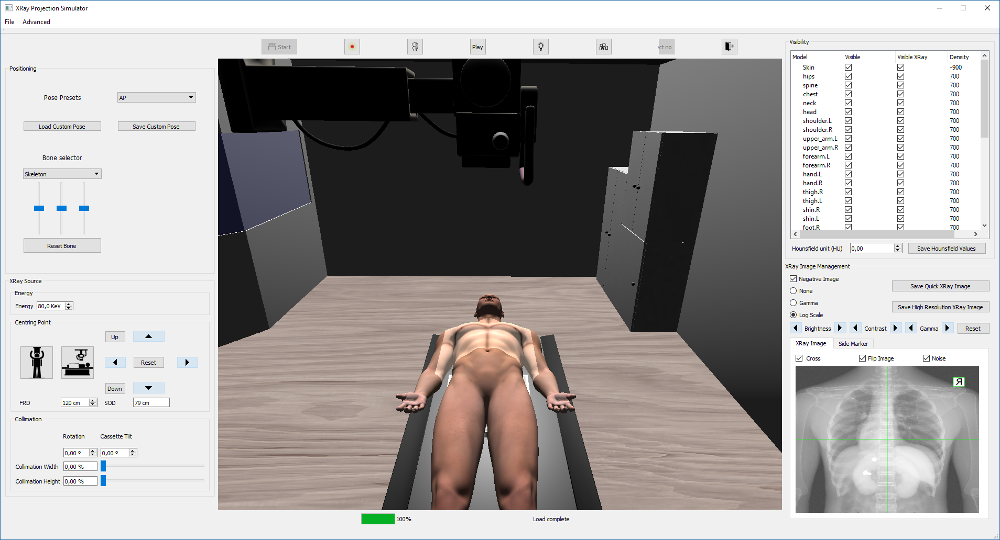

<!--
XRay:
Entorno seguro para el entrenamiento técnicos en radiología evitando riesgos de exposición a radiación
Permite simular el procedimiento completo. Posicionamiento de paciente y configuración de la máquina
Permite incluir distintos modelos de paciente de forma sencilla.
Colaboración con hospitales de UK y la universidad de Bangor

-->

---

<!-- _class: sidebar -->

# Simulated X-Ray Image Enhancing

**Deterministic simulation** +  
**Deep Learning**  
to mimic computationally expensive high-quality Montecarlo simulations

<!--
Simulated X-Ray Image Enhancing 
Las técnicas de Montecarlo permiten simular de forma precisa cómo los fotones interactúan con los distintos materiales de la escena 
Problema: obtener buenos tiene un coste computacional elevado.
La imagen de arriba a la izquierda se ha simulado utilizando 10^9 fotones en unas 70 horas (en un servidor con capacidad para ejecutar 20 hilos en paralelo!), la imagen del centro se simula en menos de un segundo, en un PC de sobremesa. 
Problema: Al simularse de forma determinista solo se tiene en cuenta la energía que absorben los tejidos, no el scatering. 
Pretendemos usar DL para añadir efectos de scattering en la imagen final.

-->

---

<!-- _class: text -->

# VG-Lab in HPB

**Ramp-Up**  
T7.3.2 – Neuroscience-specific visualization

**SGA1**  
T1.4.2 – Visual analysis tools for microanatomical data  
T7.3.2 – Neuroscience-specific visualization

**SGA2**  
T1.4.4 – Towards an integrated framework for the acquisition and early analysis of microanatomical data  
T7.3.8 – In-situ visual analysis of simulation data  
T7.3.9 – Low-level visualisation backend

**SGA3**  
T5.7 – Visualisation framework (SC3)

---

<!-- _class: figure -->

# Visualization ecosystem

ffmpeg -i media10.avi \\  
-map 0:v:0 -map 0:a? \\  
-c:v libx264 -crf 18 -preset medium \\  
-c:a aac -b:a 192k \\  
-movflags +faststart \\  
media10.mp4

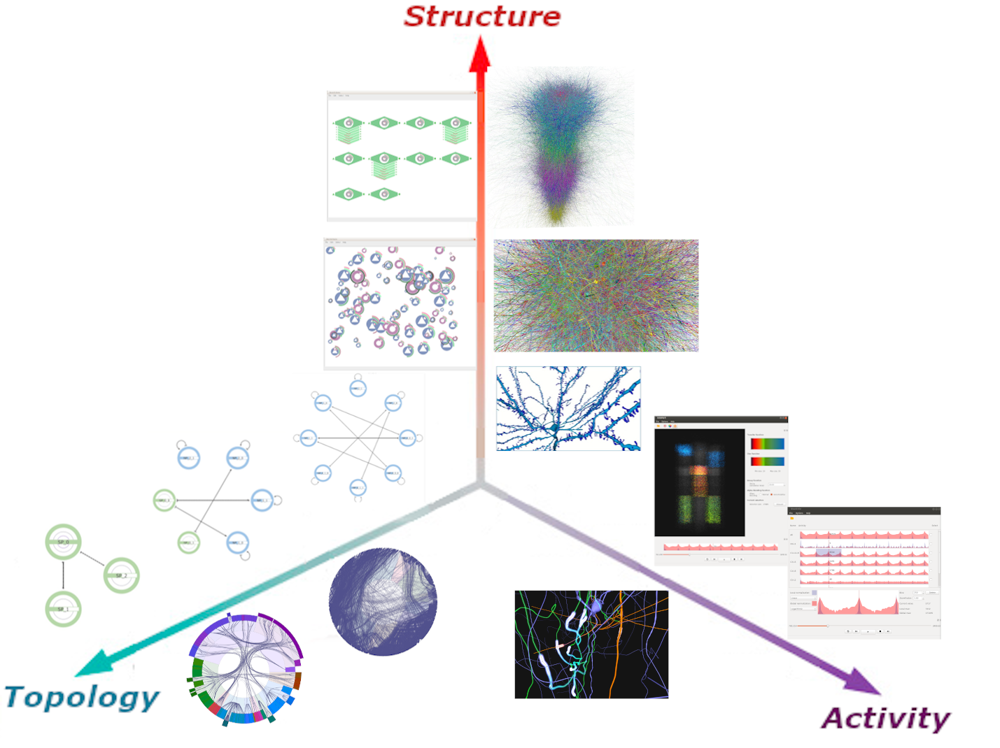

<!--
MelVin: https://vg-lab.es/melvin/
Es un Metaframework WEB para el desarrollo de aplicaciones de visualización, especialmente útil en tareas de prototipado rápido y análisis exploratorio interactivo.
Ha sido diseñado para integrar visualizaciones y procesos de análisis de datos, desarrollados con distintas tecnologías, dotándolos de mecanismos de interoperabilidad
Pensado para extenderse y adaptarse a distintas áreas de investigación. 
El proceso de análisis de datos puede definirse de forma simple mediante diagramas de flujo
A diferencia de la mayoría de las aplicaciones de minería de datos basadas en diagramas de flujo, MeLVin permite a los usuarios incluir visualizaciones y las interacciones entre estas como parte del proceso de análisis y no sólo como una herramienta para mostrar los resultados finales

-->

---

<!-- _class: sidebar -->

# Melvin

A graphical meta-framework for prototyping data visualization and exploratory analysis

<video controls preload="none" playsinline poster="assets/images/image26.png" src="assets/videos/slide-11-2066184930.mp4" aria-label="SnapSave.io-MeLVin(360p)"></video>

ffmpeg -i media10.avi \\  
-map 0:v:0 -map 0:a? \\  
-c:v libx264 -crf 18 -preset medium \\  
-c:a aac -b:a 192k \\  
-movflags +faststart \\  
media10.mp4

<!--
MelVin: https://vg-lab.es/melvin/
Es un Metaframework WEB para el desarrollo de aplicaciones de visualización, especialmente útil en tareas de prototipado rápido y análisis exploratorio interactivo.
Ha sido diseñado para integrar visualizaciones y procesos de análisis de datos, desarrollados con distintas tecnologías, dotándolos de mecanismos de interoperabilidad
Pensado para extenderse y adaptarse a distintas áreas de investigación. 
El proceso de análisis de datos puede definirse de forma simple mediante diagramas de flujo
A diferencia de la mayoría de las aplicaciones de minería de datos basadas en diagramas de flujo, MeLVin permite a los usuarios incluir visualizaciones y las interacciones entre estas como parte del proceso de análisis y no sólo como una herramienta para mostrar los resultados finales

-->

---

<!-- _class: text -->

# VG-Lab in HPB

**Ramp-Up**  
T7.3.2 – Neuroscience-specific visualization

**SGA1**  
**T1.4.2 – Visual analysis tools for microanatomical data**  
T7.3.2 – Neuroscience-specific visualization

**SGA2**  
T1.4.4 – **Towards an integrated framework for the acquisition and early analysis of microanatomical data**  
T7.3.8 – In-situ visual analysis of simulation data  
T7.3.9 – Low-level visualisation backend

**SGA3**  
T5.7 – Visualisation framework (SC3)

---

<!-- _class: sidebar -->

# DeepSpineNet

**Deep Learning-based automatic dendritic spine segmentation +**  
user-supervised correction algorithms

[https://vg-lab.es/deepspinenet/](https://vg-lab.es/deepspinenet/)

[https://gitfront.io/r/user-4306573/be116855b22f779ae17fb981f89fbd138ac27133/DeepSpineNet-GUI/](https://gitfront.io/r/user-4306573/be116855b22f779ae17fb981f89fbd138ac27133/DeepSpineNet-GUI/)

<video controls preload="none" playsinline poster="assets/images/image28.png" src="assets/videos/slide-13-1419470627.mp4" aria-label="DSNet2"></video>

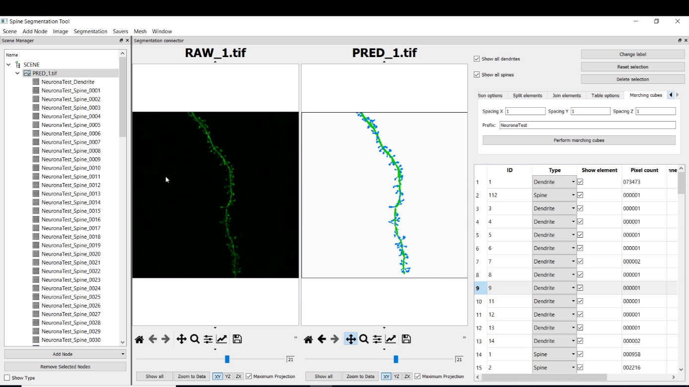

<video controls preload="none" playsinline poster="assets/images/image29.png" src="assets/videos/slide-13-955489805.mp4" aria-label="DSNet3"></video>

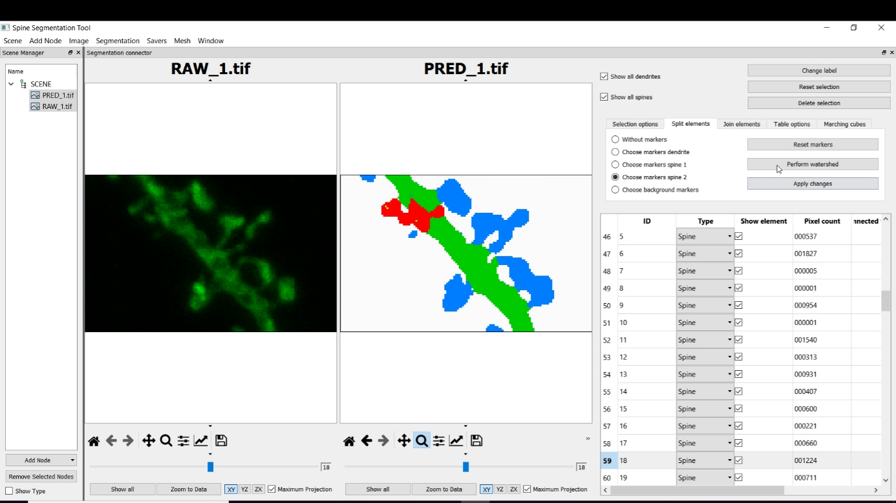

<!--
Problemas:
Los dataset científicos suelen ser escasos y débilmente etiquetados. 
Proponemos:
Algoritmos automáticos para mejorar la calidad de los datos de entrenamiento
Técnicas que reducen los problemas de “overfiting” derivados de la mala calidad de los datos, durante el entrenamiento.
Algoritmos de corrección que permiten seguir mejorando el GT.
-->

---

<!-- _class: figure -->
<!-- _footer: "26" -->

# Computer Vision and Deep Learning (II)

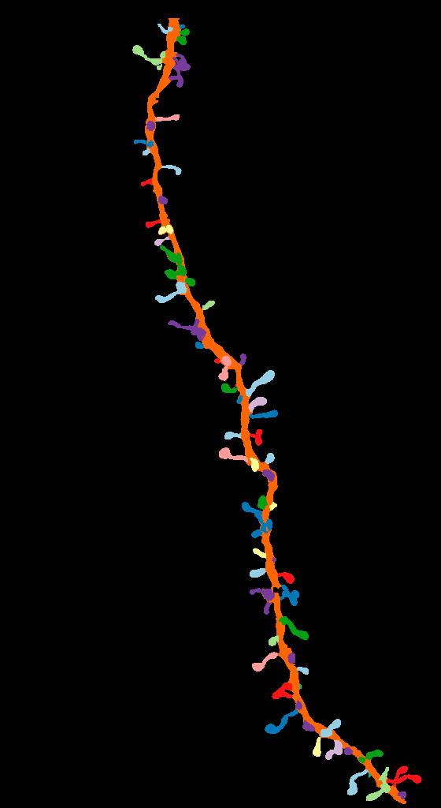

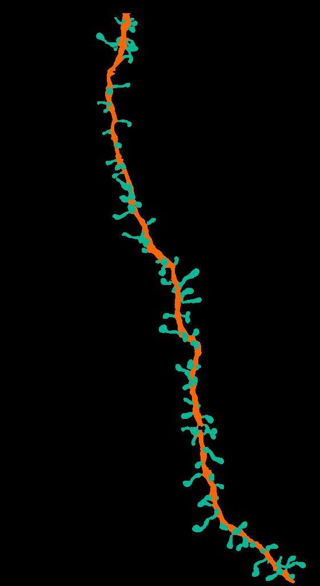

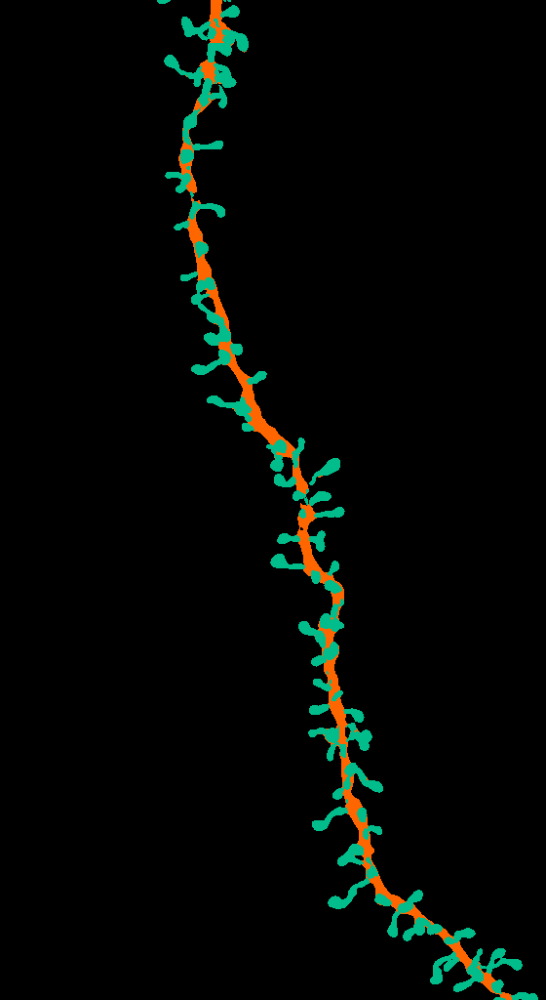

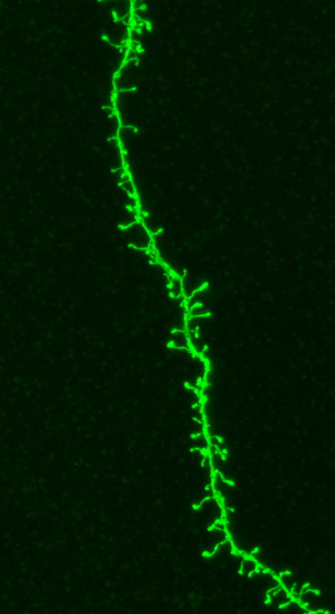

**Instance segmentation**

**RAW image**

**Manual labels**

**Semantic segmentation**

<!--
In the time remaining, 
I would like to present our work 
on the segmentation of dendritic spines 
capture with confocal microscopy.  

-->

---

<!-- _class: figure -->
<!-- _footer: "27" -->

# Computer Vision and Deep Learning (III)

Deep learning-based models have been successfully applied to many segmentation and classification problems.

These techniques face several challenges that hinder their application in the biomedical field:

**Image stacks:**  
Current state of the art models work with 2D images  
3D image stacks require complex models

**Scarce datasets:**  
Complex problems require complex models.  
Complex models require large datasets for training.

**Weakly labeled datasets:**  
Incomplete segmentations.  
For instance, scientists are generally not interested in segmenting the entire image.

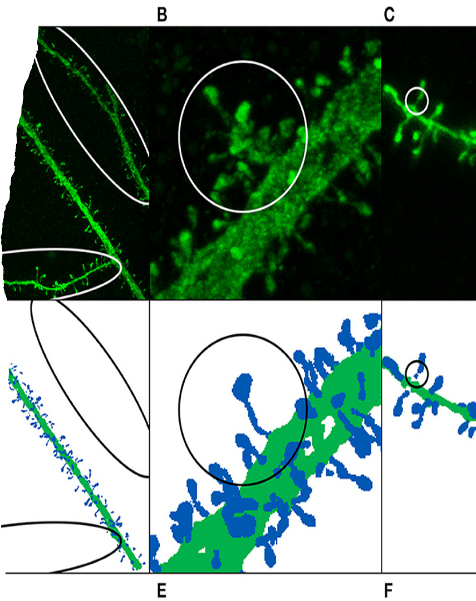

<!--
As most of you already know, deep learning-based models have been successfully applied to many segmentation and classification problems.  
 
However, 
in this problem, and in this field,
these techniques have to face challenges 
that hinder their application.  
 
In this case:  
We have to deal with Image Stacks
Current state of the art models mainly work with 2D images 
Additionally,
       processing 3D images require complex models
 
- [Complex problems require complex models with a high number of parameters ]
And complex models require large datasets for training. 
 
Since segmenting dendritic spines  is hard and time-consuming,
it is difficult to find datasets large enough to train DL models with guarantees.

- Finally, most of the dataset segmentations are incomplete.
Generally, users are interested only in one branch of the stack
and some parts of the image are unsegemtned.

-->

---

<!-- _class: figure -->
<!-- _footer: "28" -->

# Computer Vision and Deep Learning (IV)

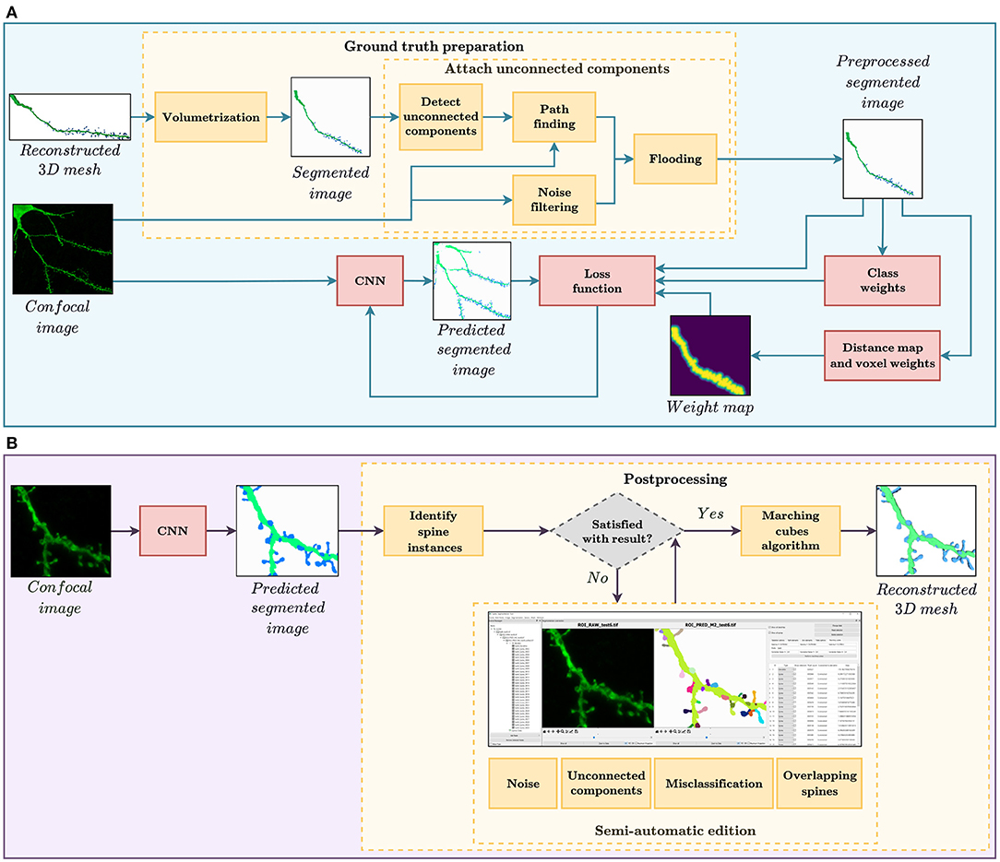

<!--
[Our proposal to address these challenges ]
Our proposed solution to address these challenges 

is based on three components:  
 
- A data pre-processing module.  
- A specific DL model adapted to this problem.  
- And a postprocessing module that allows the user to correct the model’s errors. 

-->

---

<!-- _class: figure -->
<!-- _footer: "29" -->

# Computer Vision and Deep Learning (IV)

ffmpeg -i media10.avi \\  
-map 0:v:0 -map 0:a? \\  
-c:v libx264 -crf 18 -preset medium \\  
-c:a aac -b:a 192k \\  
-movflags +faststart \\  
media10.mp4

**Preprocessing**

<!--
Our proposed solution to address these challenges is based on three components:  
 
- A data pre-processing module.  
- A specific DL model adapted to this problem.  
- And a postprocessing module that allows the user to correct the model’s errors. 

-->

---

<!-- _class: figure -->
<!-- _footer: "30" -->

# Computer Vision and Deep Learning (IV)

**Training the DL model**

**DL model**

<!--
Our proposed solution to address these challenges is based on three components:  
 
- A data pre-processing module.  
- A specific DL model 
adapted to this problem.  
- And a postprocessing module that allows the user to correct the model’s errors. 

-->

---

<!-- _class: figure -->
<!-- _footer: "31" -->

# Computer Vision and Deep Learning (IV)

**Postprocessing**

<!--
Our proposed solution to address these challenges is based on three components:  
 
- A data pre-processing module.  
- A specific DL model adapted to this specific problem.  
- And a postprocessing  module that allows the user to correct the model’s errors. 

-->

---

<!-- _class: figure -->
<!-- _footer: "32" -->

# Computer Vision and Deep Learning (V)

<!--
The preprocessing module 
primary goal 
is to create the training set and 
[automatically] reconstruct the necks 
of disconnected spines.  

-->

---

<!-- _class: figure -->

# EspINA

<video controls preload="none" playsinline poster="assets/images/image38.png" src="assets/videos/slide-21-516877989.mp4" aria-label="cl04_32_33_espina_manipulate_facet"></video>

---

<!-- _class: text -->

# My work during these last year

---

<!-- _class: text -->
<!-- _backgroundImage: url("assets/images/image1.png") -->

# MMy
