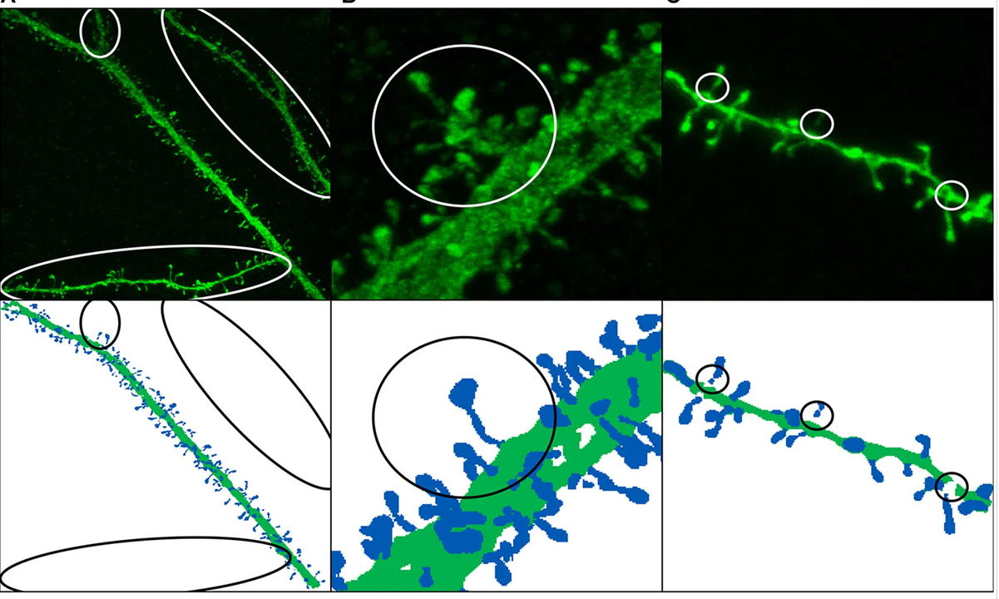
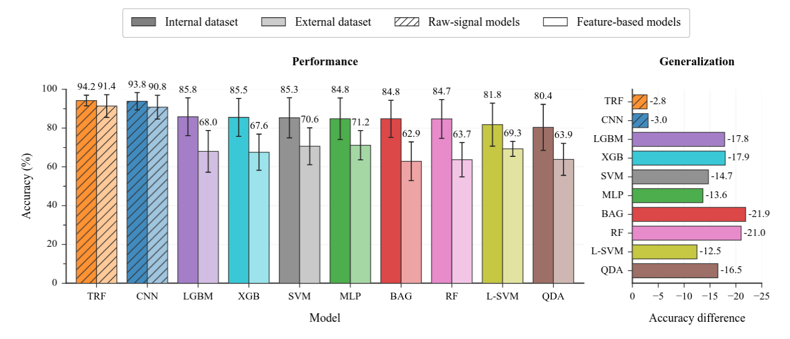

<!-- _class: cover -->

# Inside VG-LAB:  *Selected Work Lines*

*Marcos García Lorenzo*
marcos.garcía@urjc.es

<!--

-->

---

<!-- _class: split -->

# URJC – Rey Juan Carlos University

* Founded in 1996
* Sixth public university established in the Community of Madrid
* 5 campuses: Madrid, Móstoles, Alcorcón, Fuenlabrada, and Aranjuez
* More than 40,000 students
* Second in the Community of Madrid and seventh in Spain by student enrollment

---

<!-- _class: split -->

# ETSII

* Computer Science School
* Around 200 faculty members
* 8 bachelor's degree programs
* 9 double degree programs
* 6 master's degree programs
* 1 PhD program in IT

MÓSTOLES

<!--

-->

---

<!-- _class: figure -->

# VG-LAB

<!--

-->

---

<!-- _class: text -->

# VG-LAB

**Early research areas:**

* **Computer graphics:** Virtual reality, haptic interaction, medical training simulators, simulation, rendering
* **High-performance computing:** Distributed computing, GPGPU, load balancing

**Current research areas:**

* **Visualization:** Scientific visualization, information visualization, and exploratory analysis
* **Machine learning and deep learning**

---

<!-- _class: figure -->

# Computer Graphics and Medical Simulation

<!--
Technical degree programs in Systems and Management Informatics have been offered since the 1997–1998 academic year.
The School of Computer Engineering was established in July 2007.
-->

---

<!-- _class: sidebar -->

# Computer Graphics and Medical Simulation 

***Projectional Radiography Simulator***: An interactive learning environment for diagnostic radiography that helps educators connect theory and practice

[https://vg-lab.es/xraysim/](https://vg-lab.es/xraysim/)

<video controls preload="none" playsinline poster="assets/images/image18.png" src="assets/videos/1.mp4" aria-label="videoplayback"></video>

<!--
X-ray simulator:
This is a safe environment for training radiographers, with no risk of radiation exposure.
It simulates the full procedure, including patient positioning and machine settings.
Different patient models can be added easily.
This work is a collaboration with hospitals in the UK and Bangor University.
-->

---

<!-- _class: sidebar -->

# Enhancing Simulated X-Ray Images

**Deterministic simulation** +  
**Deep learning**  
to mimic high-quality Monte Carlo simulations with a high computational cost

<!--
Enhancing simulated X-ray images:
Monte Carlo methods accurately simulate how photons interact with different materials in the scene.
However, producing high-quality images takes a lot of computing time.
The top-left image was simulated using one billion photons. It took about 70 hours on a server running 20 threads in parallel.
The center image was simulated in less than one second on a desktop PC.
However, this deterministic simulation only accounts for the energy absorbed by tissues. It does not include scattering.
We aim to use deep learning to add scattering effects to the final image.
-->

---

<!-- _class: text -->

# VG-LAB in the Human Brain Project

<!--
The Human Brain Project, or HBP, was a European research project.
These were the tasks that VG-LAB contributed to during its different phases.
-->

**Ramp-Up**  
> T7.3.2 – Neuroscience-specific visualization

**SGA1**  
>T1.4.2 – Visual analysis tools for microanatomical data  
>T7.3.2 – Neuroscience-specific visualization

**SGA2**  
>T1.4.4 – Towards an integrated framework for the acquisition and early analysis of microanatomical data  
>T7.3.8 – In-situ visual analysis of simulation data  
>T7.3.9 – Low-level visualisation backend

**SGA3**  
> T5.7 – Visualisation framework (SC3)

---

<!-- _class: split -->

# VG-LAB in EBRAINS

<!--
EBRAINS is a European project.
Here are our contributions to EBRAINS 2.0 and the Virtual Brain Twin project.
-->

**Virtual Brain Twin Project (HORIZON-HLTH-2023-TOOL-05-03)**  
> Developing a GUI for integrative workflows

**EBRAINS 2.0 Project (HORIZON-INFRA-2022-SERV-B-01)**
> Developing SimVisSuite, a visualization framework for neuroscience data

---

<!-- _class: figure -->

# Visualization Ecosystem

---

<!-- _class: sidebar -->

# MeLVin

A graphical meta-framework for prototyping data visualization and exploratory analysis

<video controls preload="none" playsinline poster="assets/images/image26.png" src="assets/videos/2.mp4" aria-label="SnapSave.io-MeLVin(360p)"></video>

<!--
MeLVin: https://vg-lab.es/melvin/
MeLVin is a web-based meta-framework for building visualization applications.
It is especially useful for rapid prototyping and interactive exploratory analysis.
It connects visualizations and data analysis tools built with different technologies, so they can work together.
It can be extended and adapted to different research areas.
Users can define the data analysis process with simple flowcharts.
Most flowchart-based data mining tools use visualizations only to show the final results.
MeLVin also lets users include visualizations and interactions between them as part of the analysis process.
-->

---

# VG-LAB in the Human Brain Project

<!--
The Human Brain Project, or HBP, was a European research project.
These were the tasks that VG-LAB contributed to during its different phases.
-->

**Ramp-Up**  
> T7.3.2 – Neuroscience-specific visualization

**SGA1**  
> **T1.4.2 – Visual analysis tools for microanatomical data**  
> T7.3.2 – Neuroscience-specific visualization

**SGA2**  
> **T1.4.4 – Towards an integrated framework for the acquisition and early analysis of microanatomical data** 
> T7.3.8 – In-situ visual analysis of simulation data  
>T7.3.9 – Low-level visualisation backend

**SGA3**  
>  T5.7 – Visualisation framework (SC3)

---

<!-- _class: sidebar -->

# DeepSpineNet

**Automatic dendritic spine segmentation using deep learning** +  
user-supervised correction algorithms

[https://vg-lab.es/deepspinenet/](https://vg-lab.es/deepspinenet/)

<video controls preload="none" playsinline poster="assets/images/image28.png" src="assets/videos/3.mp4" aria-label="DSNet2"></video>

<video controls preload="none" playsinline poster="assets/images/image29.png" src="assets/videos/4.mp4" aria-label="DSNet3"></video>

<!--
Challenges:
Scientific datasets are often small, and their labels are incomplete or imprecise.
We propose three approaches:
- Automatic algorithms to improve the quality of the training data.
- Training techniques to reduce overfitting caused by poor-quality data.
- Correction algorithms to further improve the ground-truth labels.
-->

---

<!-- _class: text -->

# DeepSpineNet

Deep learning models have been successfully applied to many segmentation and classification problems.

Several challenges make these techniques difficult to apply in biomedical research:

**Image stacks:**  
Many state-of-the-art models work with 2D images.  
3D image stacks require complex models.

**Limited training data:**  
Complex problems require complex models.  
Complex models require large datasets for training.

**Weakly labeled datasets:**  
Incomplete segmentations.  
For instance, scientists are generally not interested in segmenting the entire image.

<!--
As most of you already know, deep learning models work well for many segmentation and classification tasks.
However, applying them to biomedical images can be difficult.

First, we work with 3D image stacks.
Many state-of-the-art models mainly work with 2D images.
Processing 3D images requires more complex models, often with many parameters.

These models need large training datasets.
Labeling dendritic spines is difficult and takes a lot of time.
This makes it hard to obtain enough labeled data to train reliable models.

Finally, the labels in many datasets are incomplete.
Researchers are often interested in only one dendritic branch in the image stack.
As a result, other parts of the image remain unlabeled.
-->
---

<!-- _class: figure -->

# DeepSpineNet

---

<!-- _class: figure -->

# DeepSpineNet

<!--
Our approach has three components:
- A preprocessing module to prepare the data.
- A deep learning model designed for this task.
- A postprocessing module that lets users correct the model's errors.
-->

---

<!-- _class: figure -->

# DeepSpineNet

**Preprocessing**

<!--
Our approach has three components:
- A preprocessing module to prepare the data.
- A deep learning model designed for this task.
- A postprocessing module that lets users correct the model's errors.
-->

---

<!-- _class: figure -->

# DeepSpineNet

**Training the DL model** · **DL model**

<!--
Our approach has three components:
- A preprocessing module to prepare the data.
- A deep learning model designed for this task.
- A postprocessing module that lets users correct the model's errors.
-->

---

<!-- _class: figure -->

# DeepSpineNet

**Postprocessing**

<!--
Our approach has three components:
- A preprocessing module to prepare the data.
- A deep learning model designed for this task.
- A postprocessing module that lets users correct the model's errors.
-->

---

<!-- _class: figure -->

# DeepSpineNet

<!--
The main goal of the preprocessing module is to create the training set and automatically reconstruct the necks of disconnected dendritic spines.
-->

---

<!-- _class: figure -->

# EspINA

<video controls preload="none" playsinline poster="assets/images/image38.png" src="assets/videos/5.mp4"></video>

---

<!-- _class: text -->

# Analyzing LPFs

* In collaboration with the Experimental and Computational Electrophysiology Group (https://cajal.csic.es/en/experimental-and-computational-electrophysiology/), which belongs to the Cajal Neuroscience Center at the Spanish National Research Council (CSIC).

 

* They are interested in brain activity using intracranial EEG recordings.
* The signals captured by electrodes are known as local field potentials (LFPs).
* These signals are composed of the sum of neuronal activity from different regions.
* This group has been working for years on the development of blind source separation techniques to isolate activity from different brain regions.
* Several methods exist, but they work with a customized version of Independent Component Analysis (ICA).
* This technique is not free from limitations.

<!--
* Esta es mi linea de trabajo mas reciente
* He estado trabajando en ella el ultimo año.
-->

---

<!-- _class: figure -->

# The Cocktail Party Problem

<video controls preload="none" playsinline src="assets/videos/v1.mp4"></video>

---

<!-- _class: figure -->

# The Cocktail Party Problem

<video controls preload="none" playsinline src="assets/videos/v2.mp4"></video>

---

<!-- _class: text -->

# ICA Limitations

* It depends on the number N of sources selected. Several approaches exist to estimate the number of sources.
 

* Basic techniques cannot recover the original signal amplitudes.
 

* Signals cannot be correlated.

    * We must remove synchronous activity from our analysis.
    * We can only work with baseline activity.

        

---

<!-- _class: figure -->

# The Cocktail Party Problem

<video controls preload="none" playsinline src="assets/videos/v3.mp4"></video>

---

# Motivation

* Although most of our recordings contain baseline activity.
* This activity is highly complex and apparently random.
 

**Our objective**:
* To determine whether we are able to identify patterns in baseline activity that allow us to distinguish brain regions;
* And whether these patterns are consistent across subjects.

> Methods based on handcrafted features usually offer better interpretability, but they are less powerful than DL models.
* Our secondary objective is to assess whether DL methods identify patterns beyond the handcrafted features we have extracted.

    

---

# Methodology

* We have worked on training ML models based on handcrafted features and DL models operating on raw signals to determine whether there are patterns in baseline activity that allow us to identify brain regions.

* We compare models with different levels of complexity to determine whether the relationships among handcrafted features that support generator identification can be captured by linear models or require more flexible nonlinear functions.

      <

---

<!-- _class: results -->

# Results

* Both feature-based and deep learning models identify brain regions from baseline activity in the test set.

* Deep learning models perform significantly better than feature-based models.

---

<!-- _class: results -->

# Results

Does deep learning capture patterns beyond our handcrafted features?

* We first examined the transformer's predictions and output probabilities.
* We then focused on cases misclassified by the feature-based models.
* In these cases, the deep learning model made predictions with high confidence.

--- 
# Future lines of work
* In recent years, significant effort has been devoted to the study of DL interpretability:
    * Explainable AI (XAI)
    * Mechanistic interpretability
  > This is certainly easier with images and text, but it is worth trying.
* Once we have shown that baseline activity contains patterns that allow us to identify brain regions, we want to determine whether we can distinguish healthy regions from regions with pathological activity.
  > In the context of epilepsy, seizures are sometimes provoked to identify regions. Being able to detect a region with pathological activity using baseline activity would be a major advance.
