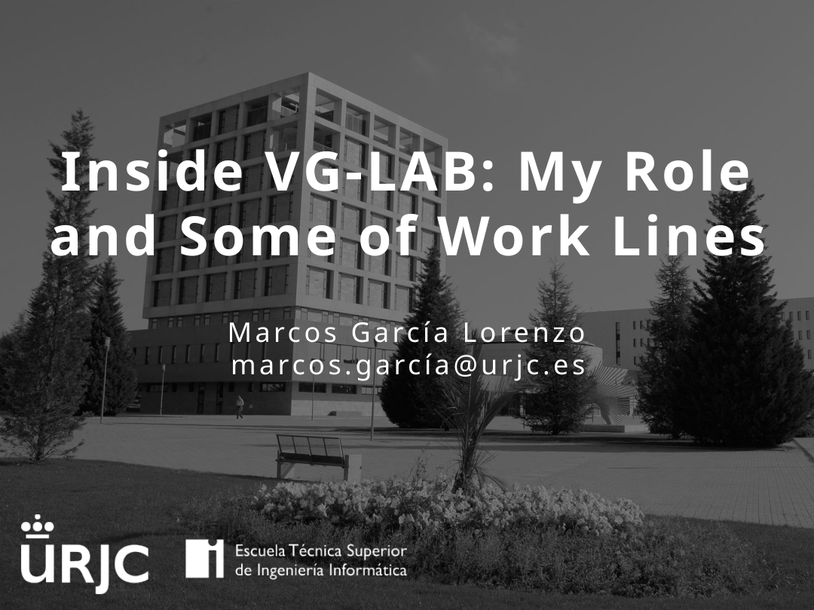

---

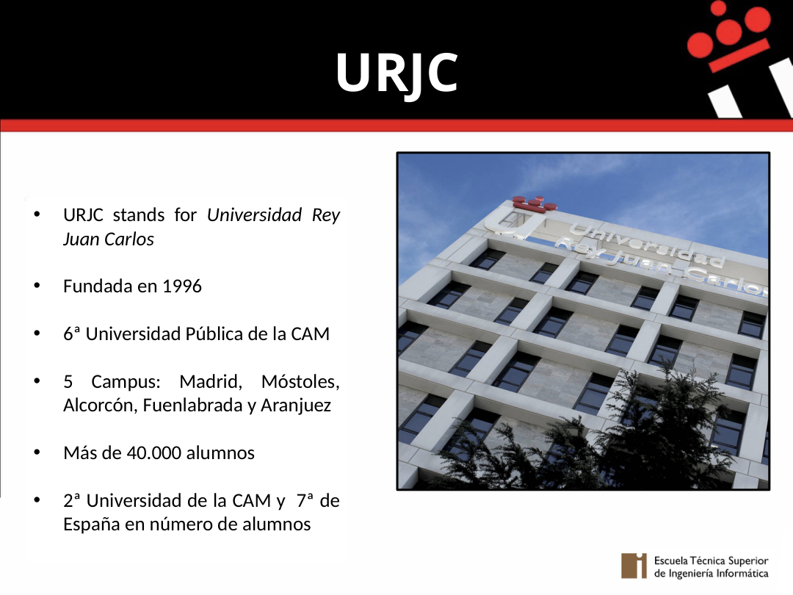

---

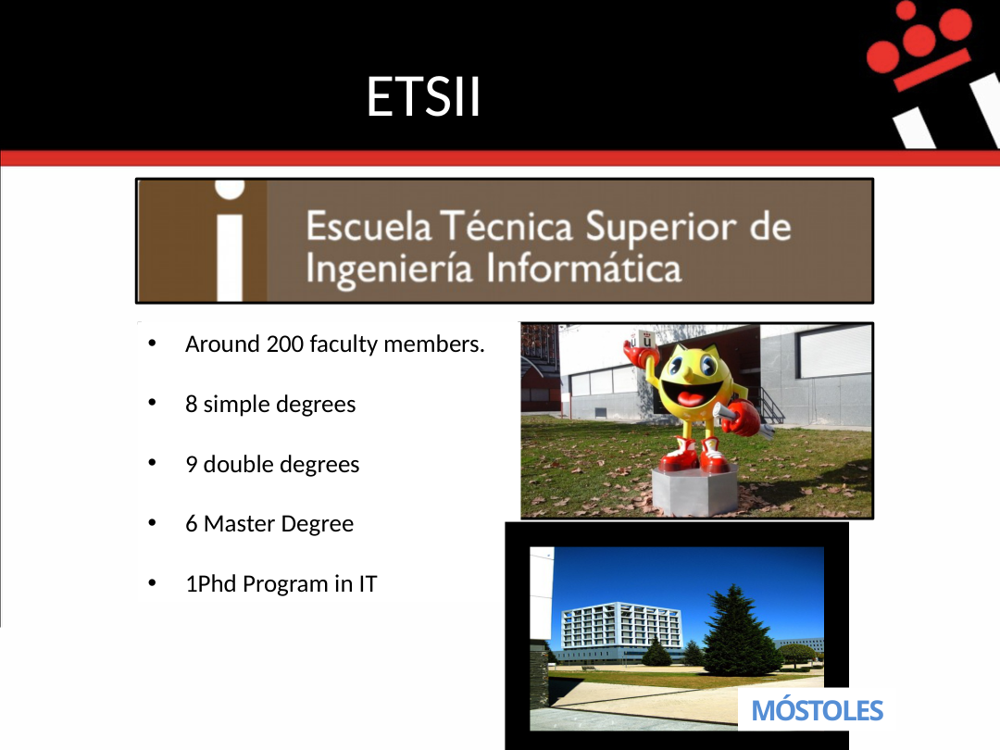

<!--
Historia:

Ingenierías Técnicas de Informática de Sistemas y de Gestión (desde el curso 97-98)

Escuela Técnica Superior de Ingeniería Informática, creada en julio del 2007
-->

---

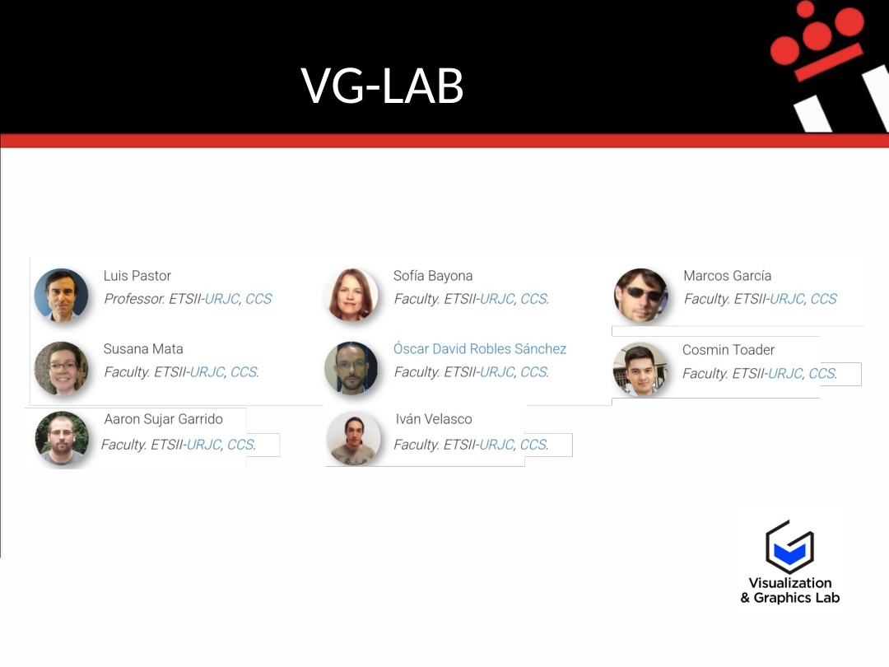

<!--
Historia:

Ingenierías Técnicas de Informática de Sistemas y de Gestión (desde el curso 97-98)

Escuela Técnica Superior de Ingeniería Informática, creada en julio del 2007
-->

---

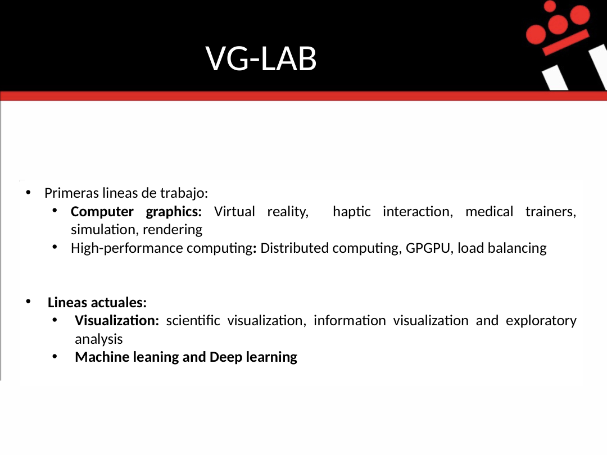

---

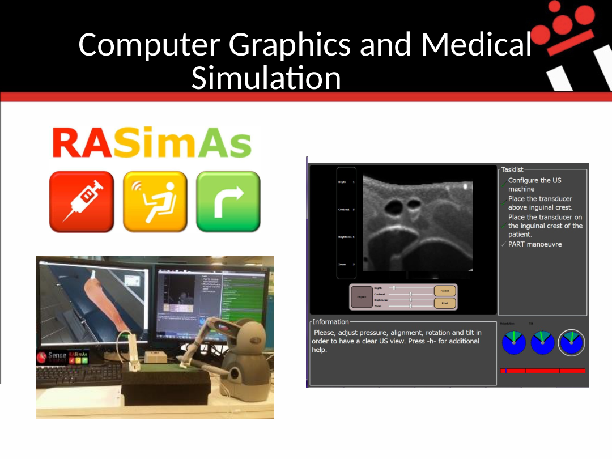

<!--

Ingenierías Técnicas de Informática de Sistemas y de Gestión (desde el curso 97-98)

Escuela Técnica Superior de Ingeniería Informática, creada en julio del 2007
-->

---

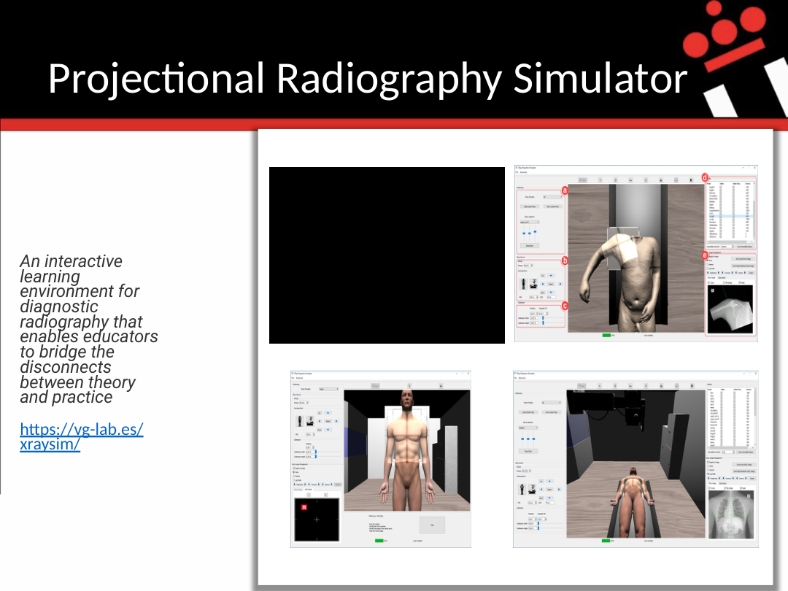

<!--
XRay:
Entorno seguro para el entrenamiento técnicos en radiología evitando riesgos de exposición a radiación
Permite simular el procedimiento completo. Posicionamiento de paciente y configuración de la máquina
Permite incluir distintos modelos de paciente de forma sencilla.
Colaboración con hospitales de UK y la universidad de Bangor

-->

---

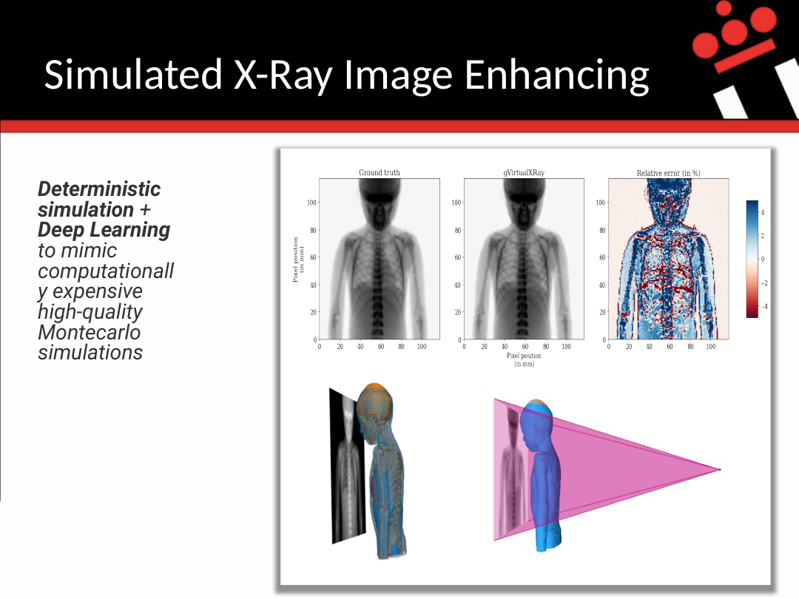

<!--
Simulated X-Ray Image Enhancing 
Las técnicas de Montecarlo permiten simular de forma precisa cómo los fotones interactúan con los distintos materiales de la escena 
Problema: obtener buenos tiene un coste computacional elevado.
La imagen de arriba a la izquierda se ha simulado utilizando 10^9 fotones en unas 70 horas (en un servidor con capacidad para ejecutar 20 hilos en paralelo!), la imagen del centro se simula en menos de un segundo, en un PC de sobremesa. 
Problema: Al simularse de forma determinista solo se tiene en cuenta la energía que absorben los tejidos, no el scatering. 
Pretendemos usar DL para añadir efectos de scattering en la imagen final.

-->

---

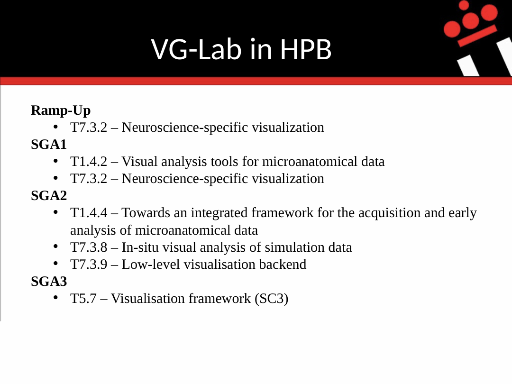

---

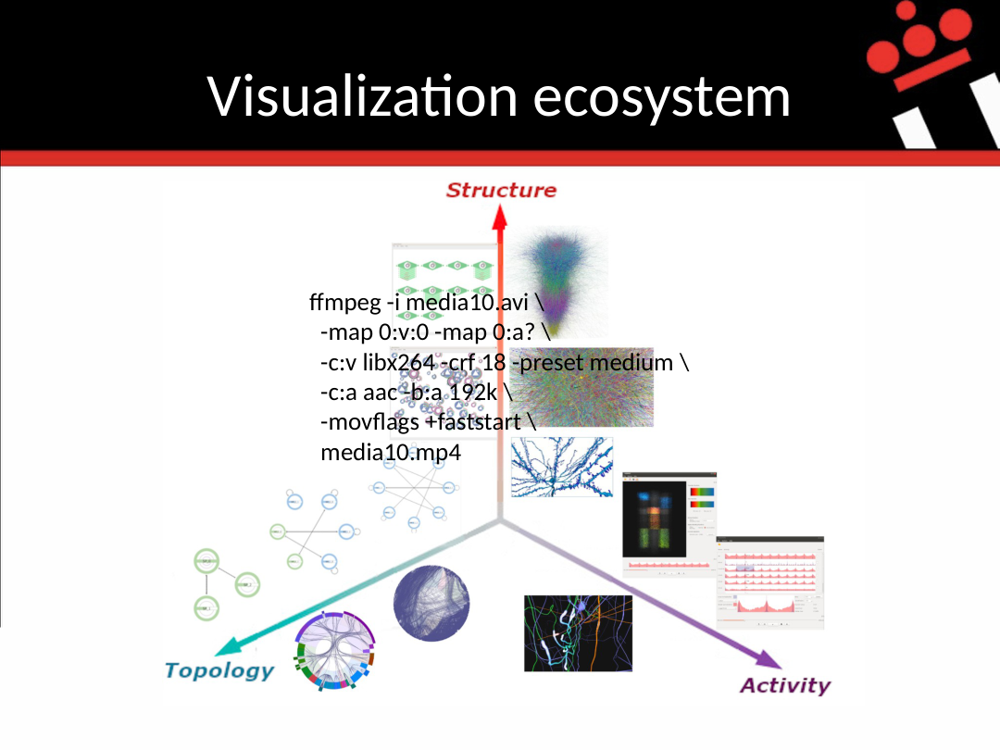

<!--
MelVin: https://vg-lab.es/melvin/
Es un Metaframework WEB para el desarrollo de aplicaciones de visualización, especialmente útil en tareas de prototipado rápido y análisis exploratorio interactivo.
Ha sido diseñado para integrar visualizaciones y procesos de análisis de datos, desarrollados con distintas tecnologías, dotándolos de mecanismos de interoperabilidad
Pensado para extenderse y adaptarse a distintas áreas de investigación. 
El proceso de análisis de datos puede definirse de forma simple mediante diagramas de flujo
A diferencia de la mayoría de las aplicaciones de minería de datos basadas en diagramas de flujo, MeLVin permite a los usuarios incluir visualizaciones y las interacciones entre estas como parte del proceso de análisis y no sólo como una herramienta para mostrar los resultados finales

-->

---

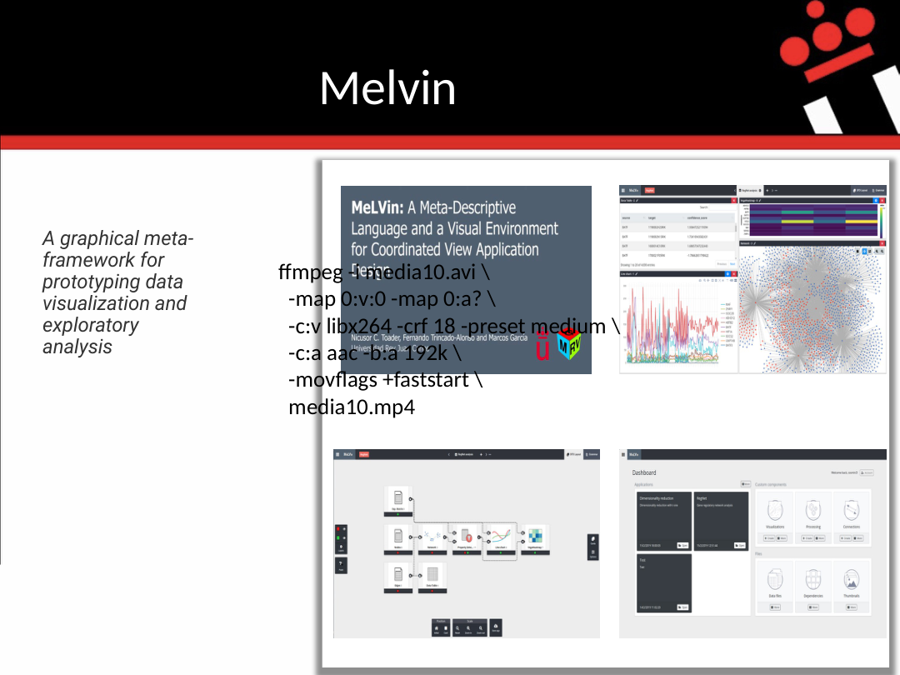

<!--
MelVin: https://vg-lab.es/melvin/
Es un Metaframework WEB para el desarrollo de aplicaciones de visualización, especialmente útil en tareas de prototipado rápido y análisis exploratorio interactivo.
Ha sido diseñado para integrar visualizaciones y procesos de análisis de datos, desarrollados con distintas tecnologías, dotándolos de mecanismos de interoperabilidad
Pensado para extenderse y adaptarse a distintas áreas de investigación. 
El proceso de análisis de datos puede definirse de forma simple mediante diagramas de flujo
A diferencia de la mayoría de las aplicaciones de minería de datos basadas en diagramas de flujo, MeLVin permite a los usuarios incluir visualizaciones y las interacciones entre estas como parte del proceso de análisis y no sólo como una herramienta para mostrar los resultados finales

-->

---

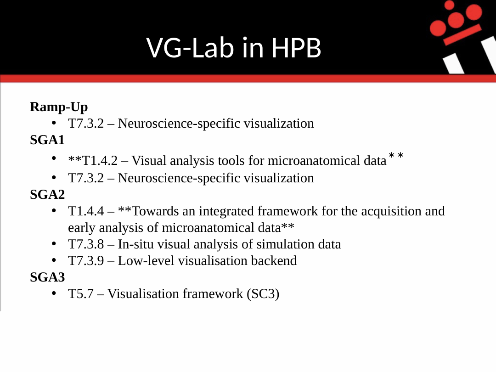

---

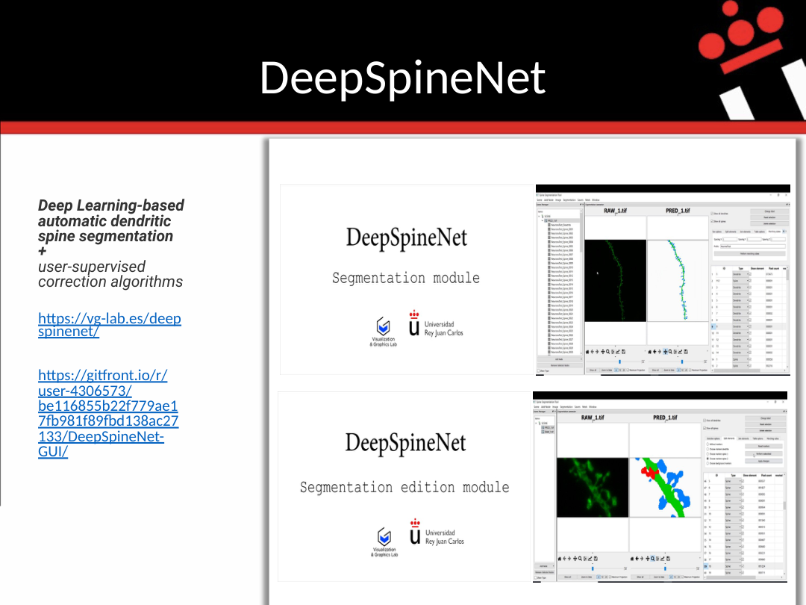

<!--
Problemas:
Los dataset científicos suelen ser escasos y débilmente etiquetados. 
Proponemos:
Algoritmos automáticos para mejorar la calidad de los datos de entrenamiento
Técnicas que reducen los problemas de “overfiting” derivados de la mala calidad de los datos, durante el entrenamiento.
Algoritmos de corrección que permiten seguir mejorando el GT.
-->

---

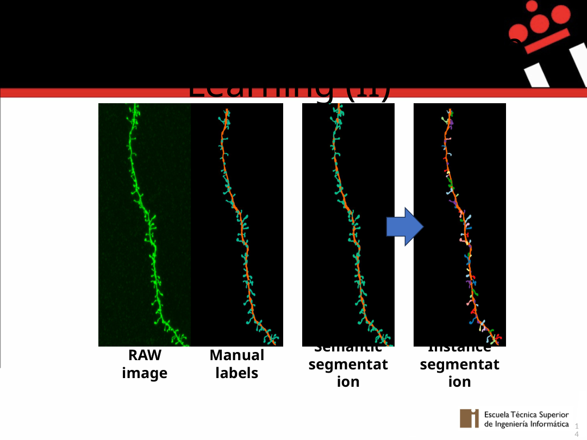

<!--
In the time remaining, 
I would like to present our work 
on the segmentation of dendritic spines 
capture with confocal microscopy.  

-->

---

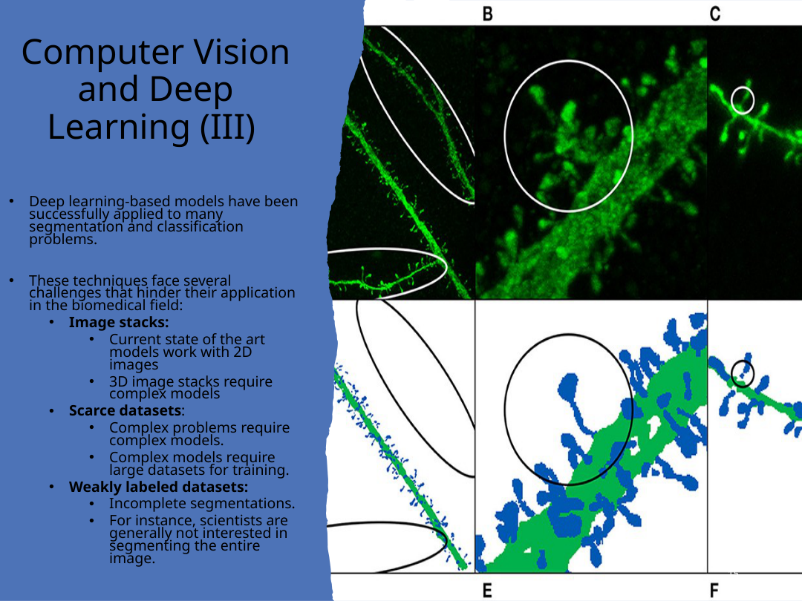

<!--
As most of you already know, deep learning-based models have been successfully applied to many segmentation and classification problems.  
 
However, 
in this problem, and in this field,
these techniques have to face challenges 
that hinder their application.  
 
In this case:  
We have to deal with Image Stacks
Current state of the art models mainly work with 2D images 
Additionally,
       processing 3D images require complex models
 
- [Complex problems require complex models with a high number of parameters ]
And complex models require large datasets for training. 
 
Since segmenting dendritic spines  is hard and time-consuming,
it is difficult to find datasets large enough to train DL models with guarantees.

- Finally, most of the dataset segmentations are incomplete.
Generally, users are interested only in one branch of the stack
and some parts of the image are unsegemtned.

-->

---

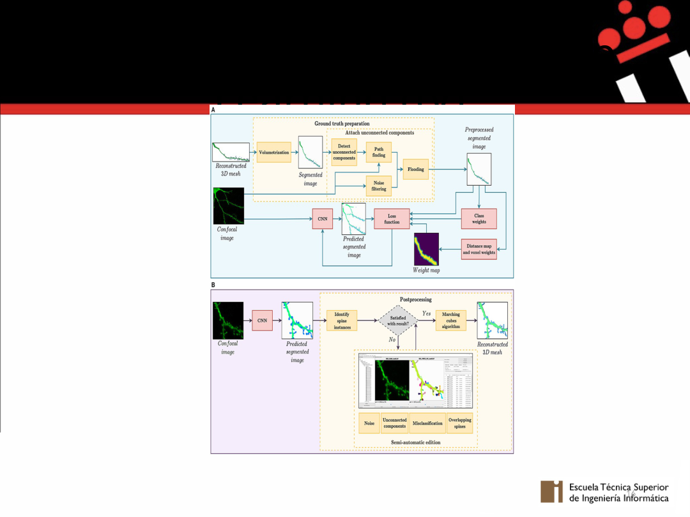

<!--
[Our proposal to address these challenges ]
Our proposed solution to address these challenges 

is based on three components:  
 
- A data pre-processing module.  
- A specific DL model adapted to this problem.  
- And a postprocessing module that allows the user to correct the model’s errors. 

-->

---

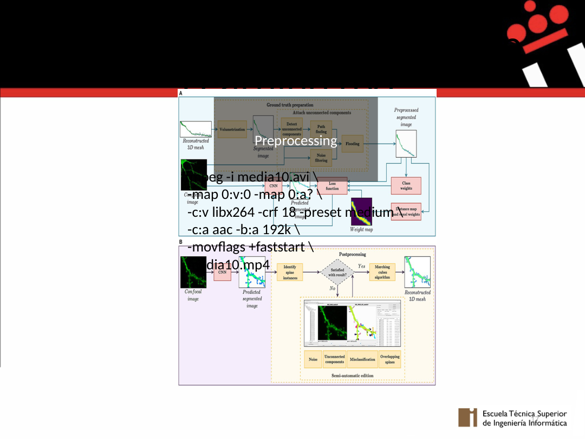

<!--
Our proposed solution to address these challenges is based on three components:  
 
- A data pre-processing module.  
- A specific DL model adapted to this problem.  
- And a postprocessing module that allows the user to correct the model’s errors. 

-->

---

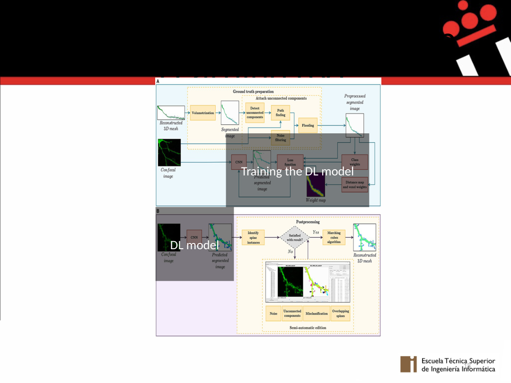

<!--
Our proposed solution to address these challenges is based on three components:  
 
- A data pre-processing module.  
- A specific DL model 
adapted to this problem.  
- And a postprocessing module that allows the user to correct the model’s errors. 

-->

---

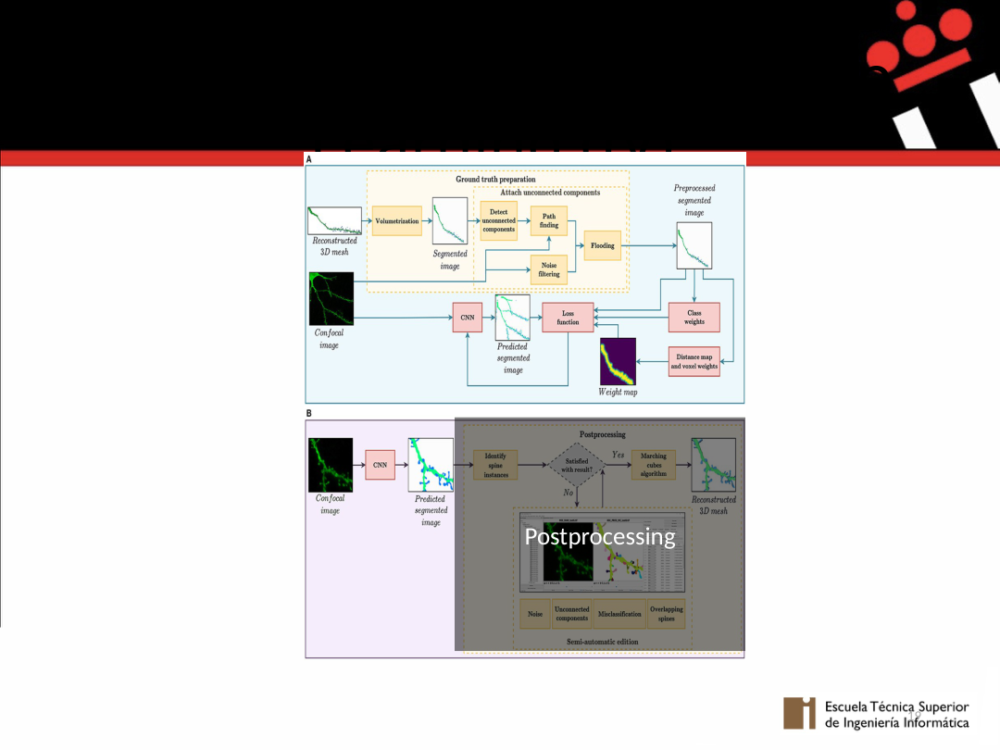

<!--
Our proposed solution to address these challenges is based on three components:  
 
- A data pre-processing module.  
- A specific DL model adapted to this specific problem.  
- And a postprocessing  module that allows the user to correct the model’s errors. 

-->

---

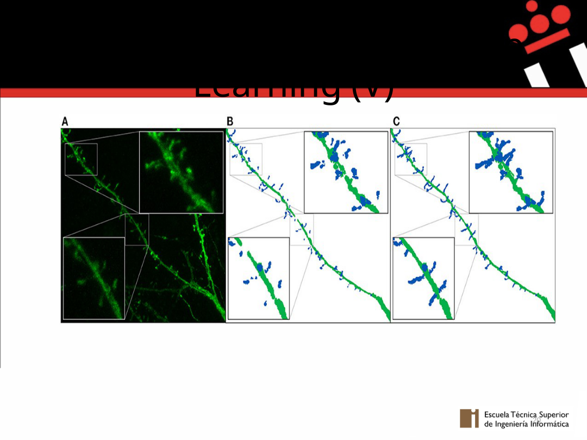

<!--
The preprocessing module 
primary goal 
is to create the training set and 
[automatically] reconstruct the necks 
of disconnected spines.  

-->

---

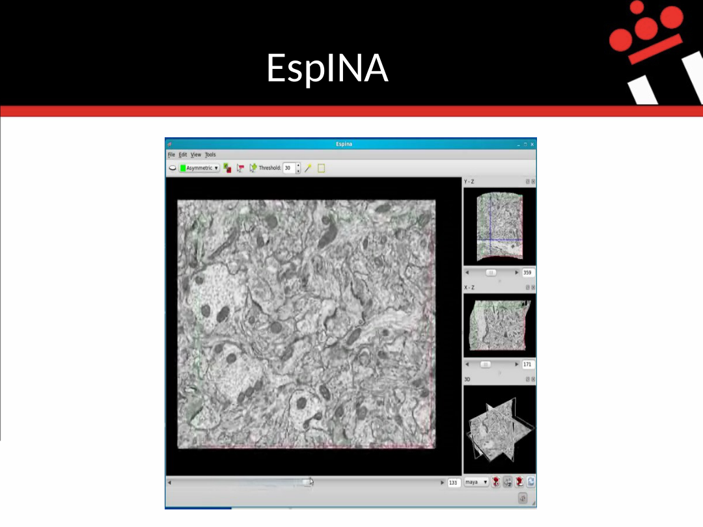

---

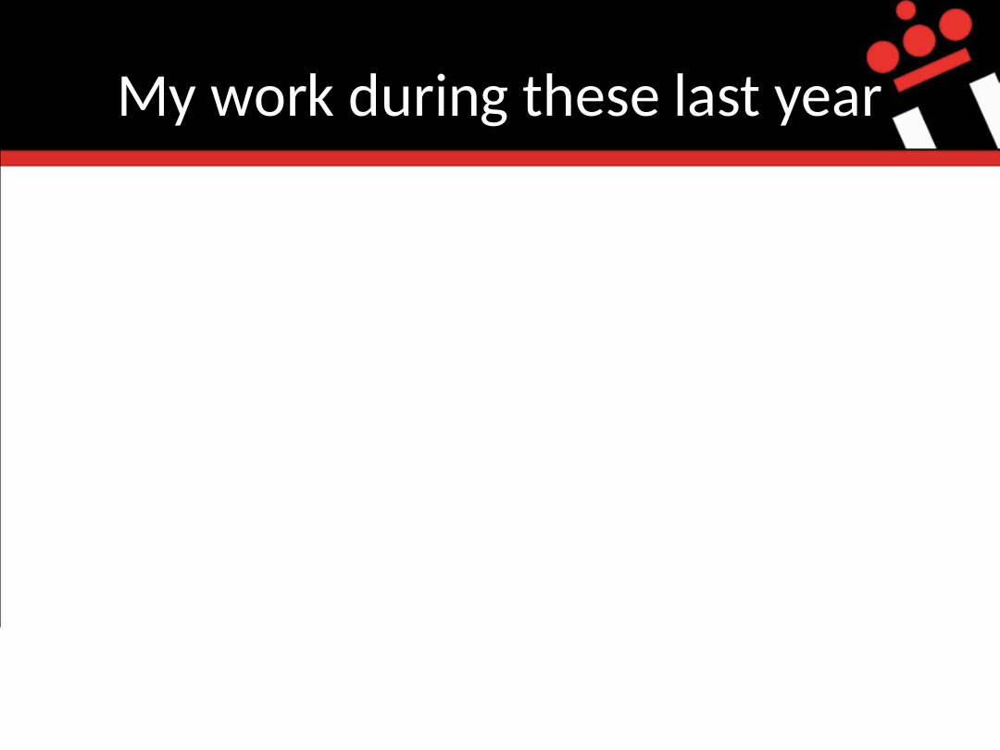

---

