<!-- _class: cover -->

# Inside VG-LAB:  *Selected Research Areas*

*Marcos García Lorenzo*
marcos.garcía@urjc.es

<!--
* First, I would like to thank Boris for the opportunity to present my work
* and to thank Sandra for inviting me to (visit|stay at) the center during the next two months.

* Although our groups have been collaborating over the past few years,

* I haven't been involved in those collaborations.

* For this reason, **first**, I wanted to put my work in the context of my group.
-->

---

<!-- _class: split -->

# URJC – Rey Juan Carlos University

* Founded in 1996
* Sixth public university established in the Community of Madrid
* 5 campuses: Madrid, Móstoles, Alcorcón, Fuenlabrada, and Aranjuez
* More than 40,000 students
* Second in the Community of Madrid and seventh in Spain by student enrollment

<!--
* I work at  the Rey Juan Carlos University

* In Madrid, there are 6 public universities and URJC is the youngest one.

* However, we are the second largest by number of students.
-->

---

<!-- _class: split -->

# ETSII

* Computer Science School
* Around 200 faculty members
* 8 bachelor's degree programs
* 9 double bachelor's degree programs
* 6 master's degree programs
* 1 PhD program in IT

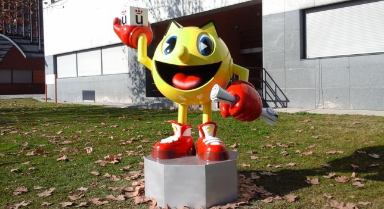

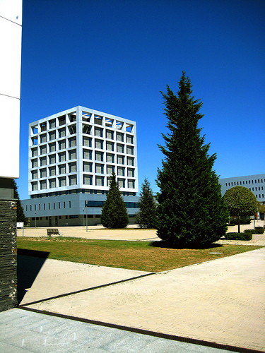

MÓSTOLES

<!--
* I'm (part of | a member) of the Computer Science School.

* We are 200 faculty members and

We offer 8 bachelor's degree programs amogn other Degress
-->

---

<!-- _class: figure -->

# VG-LAB

<!--
* The VG-Lab is my research group.

* VG-Lab stands for Visualization and Graphics Lab.

* We are a fairly small group of only 8 faculty members.
-->

---

<!-- _class: text -->

# VG-LAB

**Early research areas:**

* **Computer graphics:** Virtual reality, haptic interaction, medical training simulators, simulation, rendering
* **High-performance computing:** Distributed computing, GPGPU, load balancing

**Current research areas:**

* **Visualization:** Scientific visualization, information visualization, and exploratory analysis
* **Machine learning and deep learning**

<!--
* In earlay day, our group focused on computer graphics and high-performance computing.

* I never worked on HPC myself.

* Instead I activaly participate on the computer graphics and medical simulation lines.

* With the beginning of the Blue Brain Project and then the Human Brain Project,
our main focus shifted from computer graphics to visualization;

* And in my particular case, to the application of machine learning and deep learning to the biomedical field.
-->

---

<!-- _class: figure -->

# Computer Graphics and Medical Simulation

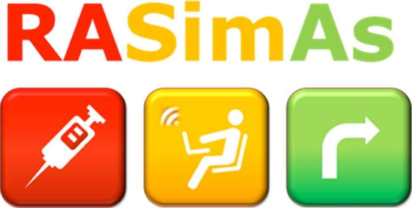

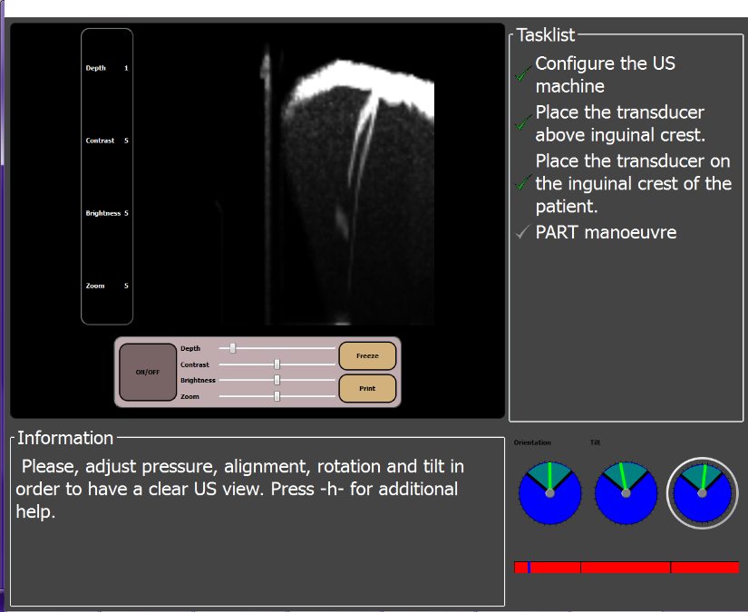

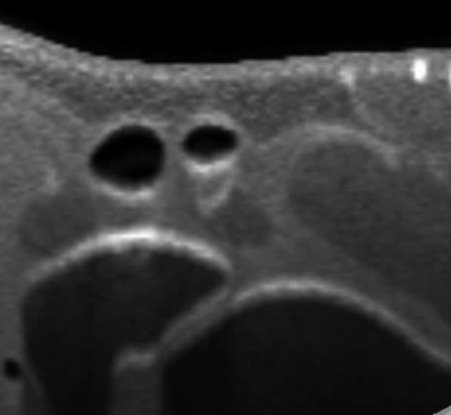

<!--
* I didn't have too much time to prepare this presentation
* I think it is too long; I want to focus on my recent work.
* Therefore, I'm going to move fast through the next slides.

* I just want to highlight this project because it was carried out in cooperation with RWTH Aachen; with Professor Dr. Torsten Kuhlen,

* In the RASIMAS project, we worked on an ultrasound-guided regional anesthesia simulator.
-->

---

<!-- _class: sidebar -->

# Computer Graphics and Medical Simulation 

***Projectional Radiography Simulator***: An interactive learning environment for diagnostic radiography that helps educators connect theory and practice

[https://vg-lab.es/xraysim/](https://vg-lab.es/xraysim/)

<video controls preload="none" playsinline poster="assets/images/image18.png" src="assets/videos/1.mp4" aria-label="videoplayback"></video>

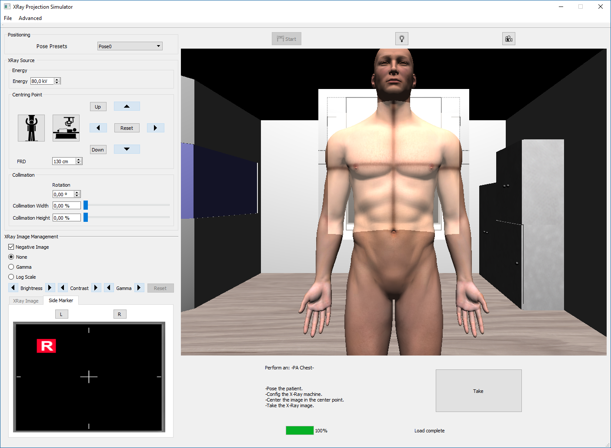

<!--
* This is our projection radiography simulator.

* I just mention it because it was one of our latest medical simulators.

* It lets the physicians train with different patient models, and
* it simulates the full procedure in real time.

* This includes patient positioning and machine settings.
-->

---

<!-- _class: sidebar -->

# Enhancing Simulated X-Ray Images

**Deterministic simulation** +  
**Deep learning**  
to mimic high-quality Monte Carlo simulations with a high computational cost

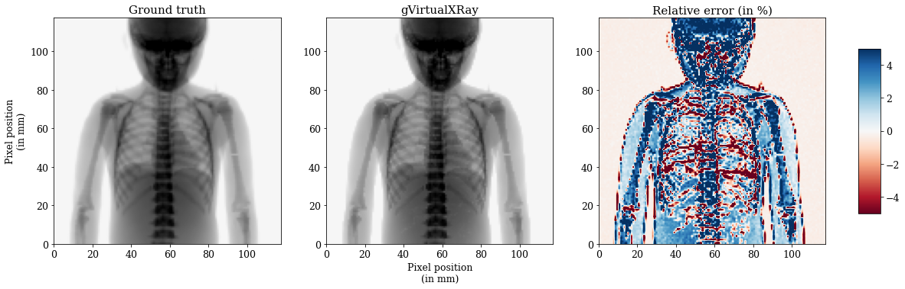

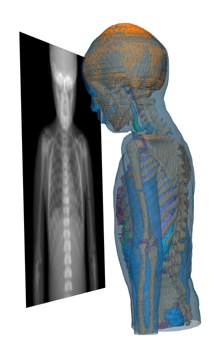

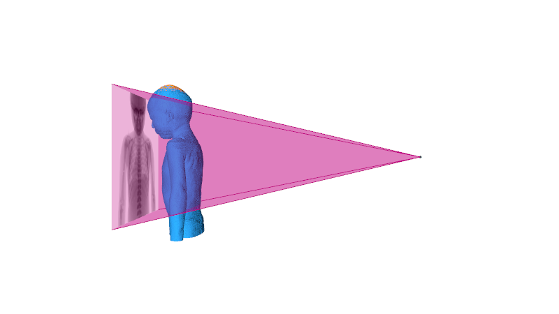

<!--
Enhancing simulated X-ray images:
* Monte Carlo methods accurately simulate how photons interact with different materials in the scene.

However, producing high-quality images takes a lot of computing time.
The top-left image was simulated using one billion photons.
It took about 70 hours on a server running 20 threads in parallel.
The center image was simulated in less than one second on a desktop PC.
However, this deterministic simulation only accounts for the energy absorbed by tissues.
It does not include scattering.
We aim to use deep learning to add scattering effects to the final image.
-->

---

<!-- _class: text -->

# VG-LAB in the Human Brain Project

**Ramp-Up**  
> T7.3.2 – Neuroscience-specific visualization

**SGA1**  
> T1.4.2 – Visual analysis tools for microanatomical data  
>T7.3.2 – Neuroscience-specific visualization

**SGA2**  
>T1.4.4 – Towards an integrated framework for the acquisition and early analysis of microanatomical data  
>T7.3.8 – In-situ visual analysis of simulation data  
>T7.3.9 – Low-level visualisation backend

**SGA3**  
> T5.7 – Visualisation framework (SC3)

<!--
* As I mentioned, Our group shtifeted theri focus to visualization and exploratory analisis during the Blue Brain project

* This research line was consolidated first in the Human Brain Project,
and now in EBRAINS 2.0 and the Virtual Brain Twin project.
-->

---

<!-- _class: split -->

# VG-LAB in EBRAINS

**Virtual Brain Twin Project (HORIZON-HLTH-2023-TOOL-05-03)**  
> Developing a GUI for integrative workflows

**EBRAINS 2.0 Project (HORIZON-INFRA-2022-SERV-B-01)**
> Developing SimVisSuite, a visualization framework for neuroscience data

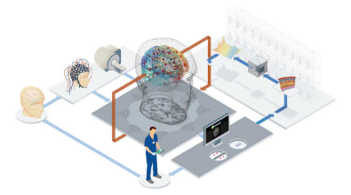

---

<!-- _class: figure -->

# Visualization Ecosystem

<!--
* Probably, most of you have seen this slide before.

* It is not my work.

* It shows the philosophy behind the visualization tools being developed in EBRAINS.

* The main idea is to develop independent tools that allow us to visualize
structural, topological, and activity data from the brain at different scales

* And provide them with communication mechanisms so they can work together.
-->

---

<!-- _class: sidebar -->

# MeLVin

A graphical meta-framework for prototyping data visualization and exploratory analysis

<video controls preload="none" playsinline poster="assets/images/image26.png" src="assets/videos/2.mp4" aria-label="SnapSave.io-MeLVin(360p)"></video>

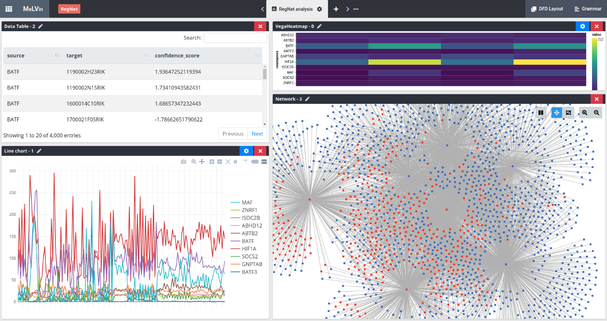

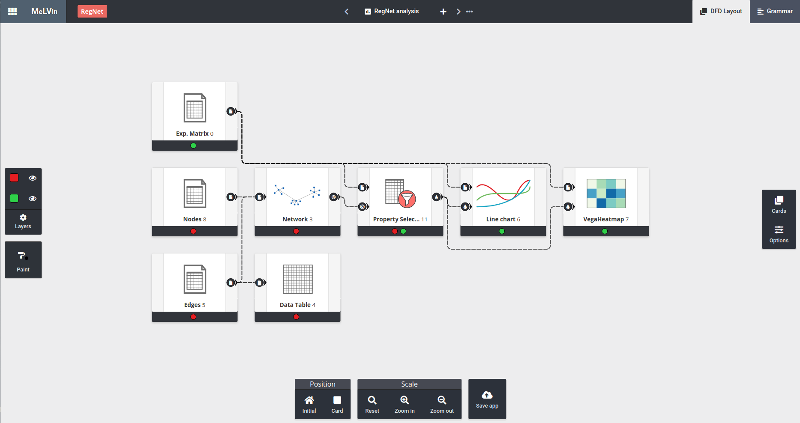

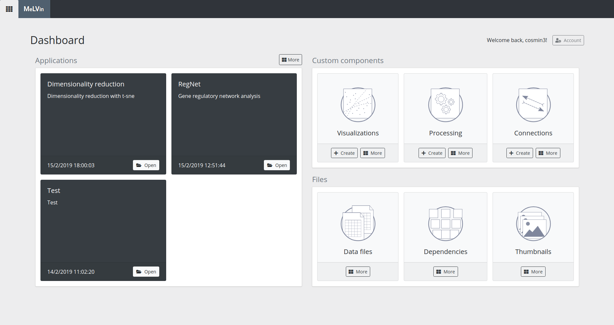

<!--
* During the HBP, I worked a little bit on visualization,

* But going in the opposite direction,

* I worked on a framework to integrate web-based in single visualization technologies and data analysis tools.

MeLVin: https://vg-lab.es/melvin/
MeLVin is a web-based meta-framework for building visualization applications.
It is especially useful for rapid prototyping and interactive exploratory analysis.
It connects visualizations and data analysis tools built with different technologies, so they can work together.
It can be extended and adapted to different research areas.
Users can define the data analysis process with simple flowcharts.
Most flowchart-based data mining tools use visualizations only to show the final results.
MeLVin also lets users include visualizations and interactions between them as part of the analysis process.
-->

---

# VG-LAB in the Human Brain Project

**Ramp-Up**  
> T7.3.2 – Neuroscience-specific visualization

**SGA1**  
> **T1.4.2 – Visual analysis tools for microanatomical data**  
> T7.3.2 – Neuroscience-specific visualization

**SGA2**  
> **T1.4.4 – Towards an integrated framework for the acquisition and early analysis of microanatomical data** 
> T7.3.8 – In-situ visual analysis of simulation data  
>T7.3.9 – Low-level visualisation backend

**SGA3**  
>  T5.7 – Visualisation framework (SC3)

<!--
* During the HBP, I started working with neuroanatomists from the Cajal Institute.

* They were interested in developing algorithms to automate the segmentation of their data.

* And this is how we started working on deep learning.

* In the remaining time that I have, I would like to show my
first and latest work in this line of work.
-->

---

<!-- _class: sidebar -->

# DeepSpineNet

**Automatic dendritic spine segmentation using deep learning** +  
user-supervised correction algorithms

[https://vg-lab.es/deepspinenet/](https://vg-lab.es/deepspinenet/)

<video controls preload="none" playsinline poster="assets/images/image28.png" src="assets/videos/3.mp4" aria-label="DSNet2"></video>

<video controls preload="none" playsinline poster="assets/images/image29.png" src="assets/videos/4.mp4" aria-label="DSNet3"></video>

<!--
* Our first development was DeepSpineNet, a deep learning tool for automatic dendritic spine segmentation from confocal microscopy images.

* The system works pretty well, but it is not perfect.

So we had to develop a set of human-supervised correction algorithms.

----

Challenges:
Scientific datasets are often small, and their labels are incomplete or imprecise.
We propose three approaches:
- Automatic algorithms to improve the quality of the training data.
- Training techniques to reduce overfitting caused by poor-quality data.
- Correction algorithms to further improve the ground-truth labels.
-->

---

<!-- _class: text -->

# DeepSpineNet

**Challenges**:
Several challenges make these techniques difficult to apply in biomedical research:

* **Image stacks:**  Many state-of-the-art models work with 2D images.  
3D image stacks require complex models.

* **Limited training data:**  Limited data is available for training.  
Complex problems require complex models.  
Complex models require large datasets for training.

* **Weakly labeled datasets:** Incomplete segmentations.  
For instance, scientists are generally not interested in segmenting the entire image.

<!--
Deep learning models work well for many segmentation and classification tasks.
However, applying them to biomedical images is still challeging.

First, we work with stacks of images.
Processing 3D images requires more complex models, often with many parameters.

These models need large training datasets.
Labeling dendritic spines is difficult and takes a lot of time.
This makes it hard to obtain enough labeled data to train reliable models.

Finally, the labels in many datasets are incomplete.
Researchers are often interested in only one dendritic branch in the image stack.
-->
---

<!-- _class: figure -->
# DeepSpineNet

<!--
In this work, we had an additional problem.

 The necks of dendritic spines sometimes cannot be recovered.
-->

---

<!-- _class: figure -->

# DeepSpineNet

<!--
Our approach has three components:
- A preprocessing module to prepare the data.
- A deep learning model designed for this task.
- A postprocessing module that lets users correct the model's errors.
-->

---

<!-- _class: figure -->

# DeepSpineNet

**Preprocessing**

<!--
Our approach has three components:
- A preprocessing module to prepare the data.
- A deep learning model designed for this task.
- A postprocessing module that lets users correct the model's errors.
-->

---

<!-- _class: figure -->

# DeepSpineNet

**Training the DL model** · **DL model**

<!--
Our approach has three components:
- A preprocessing module to prepare the data.
- A deep learning model designed for this task.
- A postprocessing module that lets users correct the model's errors.
-->

---

<!-- _class: figure -->

# DeepSpineNet

**Postprocessing**

<!--
Our approach has three components:
- A preprocessing module to prepare the data.
- A deep learning model designed for this task.
- A postprocessing module that lets users correct the model's errors.
-->

---

<!-- _class: figure -->

# DeepSpineNet

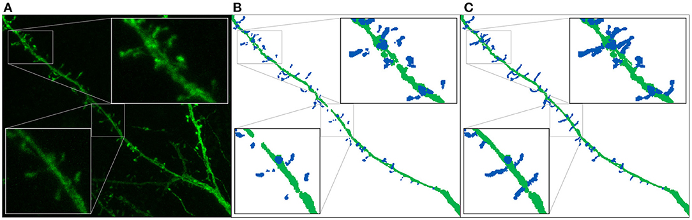

<!--
This figure shows the model's performance with and without the preprocessing module.

The model learns to connect the spines to the dendritic shaft
-->

---

<!-- _class: figure -->

# EspINA

<video controls preload="none" playsinline poster="assets/images/image38.png" src="assets/videos/5.mp4"></video>

---

<!-- _class: text -->

# Analyzing LFPs

* In collaboration with the Experimental and Computational Electrophysiology Group (https://cajal.csic.es/en/experimental-and-computational-electrophysiology/), which belongs to the Cajal Neuroscience Center at the Spanish National Research Council (CSIC).

 

* They study brain activity using intracranial EEG recordings.
* The signals captured by electrodes are known as local field potentials (LFPs).
* These signals are composed of the sum of neuronal activity from different regions.
* This group has been working for years on the development of blind source separation techniques to isolate activity from different brain regions.
* Several methods exist, but they work with a customized version of Independent Component Analysis (ICA).
* This technique is not free from limitations.

<!--
* I would like to finish my presentation showing my most recent work.
* I have been working in this line for the last year and we have some preliminary results.

 

* In this line, we are collaborating with the Experimental and Computational Electrophysiology Group from the Cajal Institute.

* They work with intracranial EEG recordings.

* The signals captured by electrodes are known as local field potentials (LFPs).

* Those signals are a mixture of the activity of different brain regions.

* They use blind source separation techniques to recover the activity of different brain regions.

* Yesterday, as a computer graphics lecturere,  I had an idea to give a graphical intution about how ICA works and their limitations
I asked ChatGPT do it.
It is not exactly what I had in mind but it I think its quite good
However I think spent to much time so far so I’m going to skip it

* However, I think I'm going to skip it to go directly to our work.
-->

---

<!-- _class: figure -->
 
# The Cocktail Party Problem

<video controls preload="none" playsinline src="assets/videos/v1.mp4"></video>

---

<!-- _class: figure -->

# The Cocktail Party Problem

<video controls preload="none" playsinline src="assets/videos/v2.mp4"></video>

---

<!-- _class: text -->

# ICA Limitations

* It depends on the number N of sources selected. Several approaches exist to estimate the number of sources.
 

* Basic techniques cannot recover the original signal amplitudes.
 

* Signals cannot be correlated.

    * We must remove synchronous activity from our analysis.
    * We can only work with baseline activity.

        

<!--
The main limitation that we have to face with ICA is that the source signals cannot be correlated.

Therefore, we are forced to remove synchronous activity from our analysis
and we can only work with baseline activity;

And just keep basal activity, which is highly complex and apparently random.
-->

---

<!-- _class: figure -->

# The Cocktail Party Problem

<video controls preload="none" playsinline src="assets/videos/v3.mp4"></video>

---

<!-- _class: figure -->

# ICA Limitations

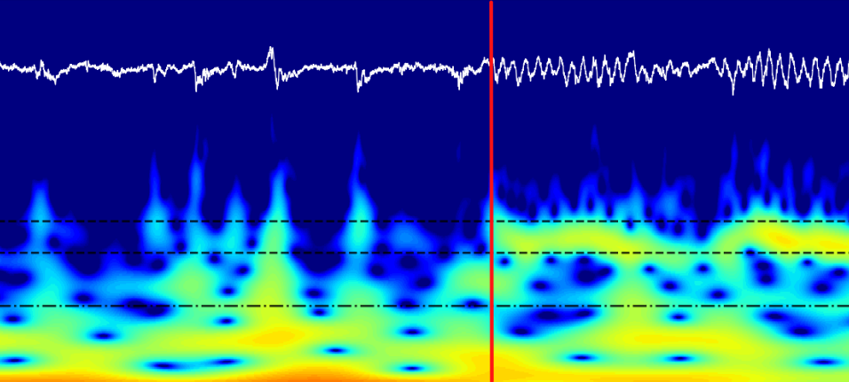

<!--
The main limitation that we have to face with ICA is that the source signals cannot be correlated.

Therefore, we are forced to remove synchronous activity from our analysis
and we can only work with baseline activity;

And just keep basal activity, which is highly complex and apparently random.

xxxxxx

Here we have a picture with the two types of activity, basal and synchronous.
-->

---

<!-- _class: figure -->

# LFP Generators

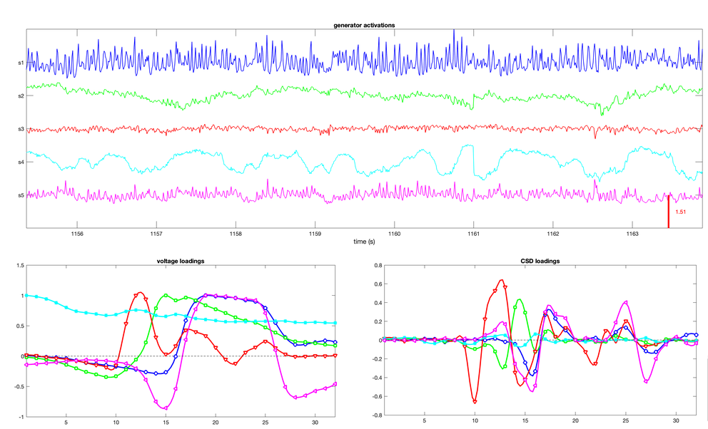

<!--
This is what we have after the blind source separation. 

At the top, we have the reconstructed signals, which are the activity of different brain regions.

The bottom row shows how the activity is distributed across the electrodes of the shaft.
-->

---

# Motivation

* Most of our recordings contain baseline activity.
* This activity is highly complex and apparently random.
 

**Our objective**:
* To determine whether we are able to identify patterns in baseline activity that allow us to distinguish brain regions;
* And whether these patterns are consistent across different subjects.
> Methods based on handcrafted features usually offer better interpretability, but they are less powerful than DL models.
* Our secondary objective is to assess whether DL methods identify patterns beyond the handcrafted features we have extracted.

    

<!--
* Most of the recordings contain baseline activity, which is OK
* However, this activity is highly complex and apparently random.

* Our goal is to see if there are patterns in baseline activity that allow us to identify brain regions;

* And whether these patterns are consistent across subjects.

XXXXXXX

* We also want to know whether DL methods identify patterns beyond our handcrafted features.

-->

---

# Methodology

* We have trained ML models based on handcrafted features and DL model operating on raw signals;

* to determine whether there are patterns in baseline activity that allow us to identify brain regions.

* Aditionally, we compare models with different levels of complexity to determine whether the relationships among handcrafted features that support generator identification can be captured by linear models or require more flexible nonlinear functions.

      

<!--
* We have trained ML models based on handcrafted features;
* and DL models operating on raw signals
to determine whether there are patterns in baseline activity that allow us to identify brain regions.

* We compare models with different levels of complexity
to see whether linear models can identify the generators,
or whether we need more flexible nonlinear models.
-->
---

<!-- _class: results -->

# Results

* Both feature-based and deep learning models identify brain regions from baseline activity in the test set.

* Deep learning models perform significantly better than feature-based models.

<!--
* What we found is that both types of models can identify brain regions from baseline activity in the test set.

* But the deep learning models perform significantly better than the models based on handcrafted features.

We used mixed-effects models to determine whether the differences in performance were statistically significant.

-->

---

<!-- _class: results -->

# Results

Does deep learning capture patterns beyond our handcrafted features?

* We first examined the alignment of the transformer's prediction probabilities.
* We then focused on cases misclassified by the feature-based models.
* In these cases, the deep learning model made predictions with high confidence.

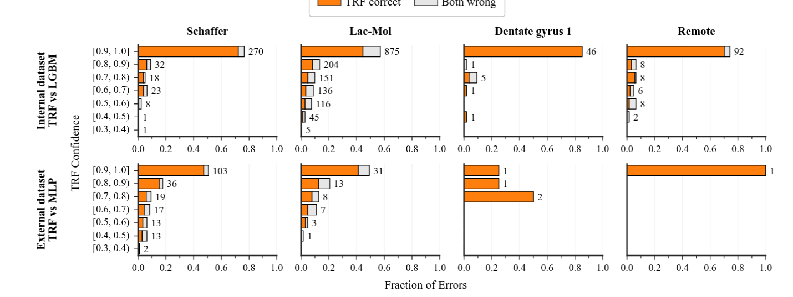

<!--
* Next, we asked whether deep learning finds patterns beyond our handcrafted features.

* We test the alignment of the transformer's prediction probabilities.

* We focused on cases where the models based on handcrafted features made mistakes.

* In these cases, We show that the deep learning model made predictions with high confidence.
-->

---
# Future lines of work
* In recent years, significant effort has been devoted to the study of DL interpretability:
    * Explainable AI (XAI)
    * Mechanistic interpretability
  > This is certainly easier with images and text, but it is worth trying.

* Once we have shown that baseline activity contains patterns that allow us to identify brain regions, we want to determine whether we can distinguish healthy regions from regions with pathological activity.
  > In the context of epilepsy, seizures are sometimes provoked to identify regions. Being able to detect a region with pathological activity using baseline activity would be a major advance.

<!--

Possible applications of our work.

Now that we have evidence that baseline activity contains patterns that allow us to identify brain regions, we want to determine whether we can distinguish healthy regions from regions with pathological activity in the baseline activity.

xxxxxxxxx

* We now want to understand which patterns the deep learning models use.

* We plan to explore explainable AI and mechanistic interpretability.

* These approaches may be easier to apply to images and text, but we want to try them with our signals.

* We also want to distinguish healthy regions from regions with pathological activity.

* The aim is to do this using baseline activity.

* This could help identify regions involved in epilepsy without provoking a seizure.
-->

